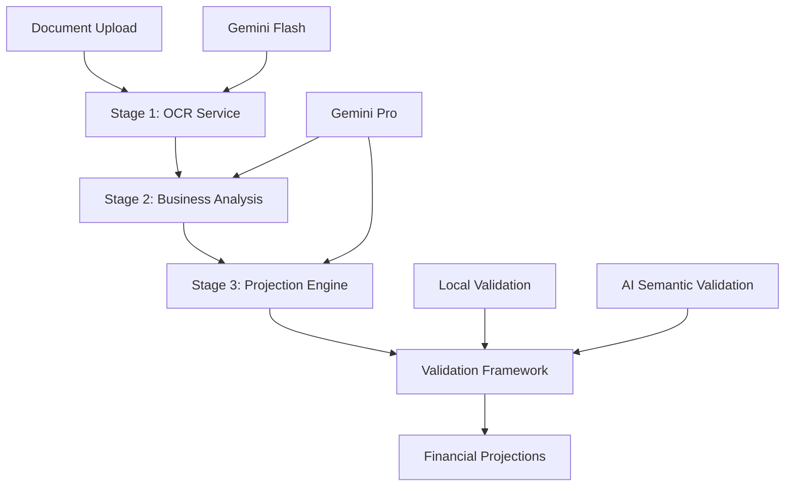

# OCR-Based Financial Projection System Documentation

## Overview

This comprehensive documentation covers the complete OCR-based Financial Projection System - a sophisticated 3-stage AI-powered platform that transforms financial documents into accurate, validated financial forecasts. The system combines document processing, business intelligence, and advanced financial modeling to deliver professional-grade projections.

## 🚀 Quick Start

1. **System Overview**: Start with [System Overview](01-system-overview.md) to understand the architecture
2. **Stage 1**: Learn about [Data Extraction](02-stage1-data-extraction.md) 
3. **Stage 2**: Understand [Business Analysis](03-stage2-business-analysis.md)
4. **Stage 3**: Master [Projection Engine](04-stage3-projection-engine.md)
5. **Quality Assurance**: Review [Validation Framework](05-validation-quality-assurance.md)
6. **Implementation**: Use [API Reference](06-api-reference-usage.md) for integration
7. **Deployment**: Follow [Configuration Guide](07-configuration-setup.md) for setup

## 📖 Documentation Structure

### 1. [System Overview](01-system-overview.md)
**Core Architecture & Key Features**
- 3-stage modular architecture
- Tiered AI model selection (Flash + Pro)
- Australian business focus
- Multi-format document support
- Advanced forecasting capabilities

### 2. [Stage 1: Data Extraction & Normalization](02-stage1-data-extraction.md)
**OCR Service & Data Processing**
- PDF and CSV file processing
- Australian FY alignment
- Quality assessment framework
- Anomaly detection
- Robust error handling

### 3. [Stage 2: Business Analysis & Methodology Selection](03-stage2-business-analysis.md)
**Business Intelligence & Forecasting Strategy**
- Industry classification
- Pattern recognition & trend analysis
- Methodology experimentation
- Specific assumption definition
- Risk assessment

### 4. [Stage 3: Projection Engine & Financial Forecasting](04-stage3-projection-engine.md)
**3-Way Forecasting & Calculation Chains**
- Integrated P&L, Cash Flow, Balance Sheet
- Dividend policy implementation (40% payout)
- Calculation chain transparency
- Multi-horizon projections (1, 3, 5, 10, 15 years)
- Scenario planning

### 5. [Validation & Quality Assurance](05-validation-quality-assurance.md)
**Multi-Layer Validation Framework**
- Mathematical validation
- Financial reconciliation
- Business logic validation
- AI semantic validation
- Cross-statement consistency

### 6. [API Reference & Usage Guide](06-api-reference-usage.md)
**Integration & Implementation**
- Complete API documentation
- Request/response formats
- Error handling
- Usage examples
- Integration patterns

### 7. [Configuration & Setup Guide](07-configuration-setup.md)
**Deployment & Customization**
- Environment setup
- API key management
- Performance tuning
- Customization options
- Monitoring & troubleshooting

## 🎯 Key Features

### Advanced AI Processing
- **Gemini 2.5 Flash**: High-volume document extraction (Stage 1)
- **Gemini 2.5 Pro**: Complex business analysis and projections (Stages 2-3)
- **Tiered Model Selection**: Flash for extraction, Pro for analysis
- **Concurrency Control**: Semaphore-based quota management for Pro model calls
- **Multiple Model Support**: gemini-2.5-pro, gemini-2.5-flash, gemini-2.0-flash, gemini-1.5-pro

### Financial Modeling Excellence
- **3-Way Forecasting**: Integrated P&L, Cash Flow, Balance Sheet
- **Calculation Chains**: Transparent, auditable calculations
- **Dividend Policy**: Automated 40% quarterly dividend distribution
- **Balance Sheet Balancing**: Ensures Assets = Liabilities + Equity
- **Australian FY Alignment**: July-June financial year cycles

### Business Intelligence
- **Industry Classification**: Automated business categorization
- **Growth Analysis**: CAGR, volatility, trend analysis
- **Seasonality Detection**: Australian market seasonal patterns
- **Methodology Selection**: Data-driven forecasting approach
- **Risk Assessment**: Comprehensive risk factor identification

### Quality Assurance
- **Multi-Layer Validation**: Local validation with AI semantic checks
- **AI Semantic Validation**: Business logic validation using Gemini Flash
- **Quality Scoring**: Comprehensive quality assessment
- **Error Recovery**: Graceful degradation and fallback mechanisms

## 🏗️ System Architecture



### Processing Flow

1. **Document Ingestion**: PDF and CSV file processing with validation
2. **Data Extraction**: AI-powered OCR and normalization (Stage 1 - Flash)
3. **Business Analysis**: Context analysis and methodology selection (Stage 2 - Pro)
4. **Projection Generation**: 3-way forecast creation (Stage 3 - Pro)
5. **Quality Validation**: Multi-layer validation and quality scoring
6. **Output Delivery**: Comprehensive financial projections with metadata

## 🔧 Technical Specifications

### Supported File Formats
- **PDFs**: Up to 50MB, financial statements and reports
- **CSVs**: Up to 25MB, structured financial data
- **Images**: Up to 10MB, scanned documents (PNG, JPG, GIF, BMP, TIFF, WEBP) - via OCR endpoint only
- **Maximum Files**: 10 files per analysis
- **Timeout**: 600 seconds (10 minutes) for complete analysis

### AI Models & Strategy
- **Stage 1 (Extraction)**: Gemini 2.5 Flash - optimized for high-volume, parallel processing
- **Stage 2-3 (Analysis)**: Gemini 2.5 Pro - complex reasoning and financial modeling
- **Semaphore Control**: Maximum 3 concurrent Pro model calls to prevent quota exhaustion
- **Automatic Fallback**: Support for gemini-2.0-flash and gemini-1.5-pro

### Output Formats
- **Time Horizons**: 1, 3, 5, 10, 15-year projections
- **Granularity**: Monthly, quarterly, yearly (auto-detected)
- **Statements**: Complete P&L, Cash Flow, Balance Sheet
- **Scenarios**: Optimistic, Base Case, Conservative projections

## 🚀 Getting Started

### Prerequisites
- Python 3.8+
- Google Gemini API keys (multiple keys recommended)
- 8GB+ RAM recommended
- Stable internet connection

### Quick Setup
1. Clone the repository
2. Install dependencies: `pip install -r requirements.txt`
3. Configure environment variables (see [Configuration Guide](07-configuration-setup.md))
4. Run the application: `uvicorn backend.main:app --reload`
5. Access the API at `http://localhost:8000`

### First Analysis
```bash
curl -X POST "http://localhost:8000/multi-pdf/analyze" \
  -F "files=@financial-statement.pdf" \
  -F "files=@budget-data.csv" \
  -F "model=gemini-2.5-pro"
```

## 📊 Use Cases

### Primary Use Cases
- **Financial Planning**: Comprehensive business forecasting
- **Investment Analysis**: Due diligence and valuation support
- **Strategic Planning**: Long-term business projections
- **Risk Assessment**: Scenario analysis and stress testing
- **Compliance**: Regulatory reporting and financial planning

### Industries Supported
- **Professional Services**: Consulting, legal, accounting
- **Technology**: Software, SaaS, tech startups
- **Manufacturing**: Production, distribution, industrial
- **Retail**: E-commerce, brick-and-mortar, consumer goods
- **Healthcare**: Medical services, pharmaceuticals, biotech

## 🎯 Business Value

### For Financial Professionals
- **Automated Analysis**: Reduces manual financial modeling time
- **Enhanced Accuracy**: AI-powered data extraction and validation
- **Comprehensive Insights**: Deep business intelligence and context
- **Audit Trail**: Transparent calculation chains and assumptions
- **Scenario Planning**: Multiple projection scenarios for strategic planning

### For Businesses
- **Strategic Planning**: Data-driven long-term planning
- **Investment Decisions**: Informed capital allocation
- **Risk Management**: Comprehensive risk assessment
- **Performance Monitoring**: Benchmark against projections
- **Stakeholder Communication**: Professional financial presentations

## 🔍 Key Differentiators

### Technical Excellence
- **3-Way Forecasting**: Integrated financial statement modeling
- **Calculation Transparency**: Every calculation is auditable
- **AI-Powered Validation**: Intelligent quality assurance
- **Australian FY Focus**: Local market expertise
- **Scalable Architecture**: Handles multiple documents and scenarios

### Business Intelligence
- **Industry Classification**: Automated business categorization
- **Pattern Recognition**: Advanced trend and seasonality analysis
- **Methodology Selection**: Data-driven forecasting approach
- **Risk Assessment**: Comprehensive risk factor identification
- **Assumption Validation**: Specific, justified assumptions

## 📋 Documentation Navigation

### For Developers
1. [System Overview](01-system-overview.md) - Architecture understanding
2. [Stage 1-3 Documentation](02-stage1-data-extraction.md) - Deep technical dive
3. [API Reference](06-api-reference-usage.md) - Integration implementation
4. [Configuration Guide](07-configuration-setup.md) - Deployment setup

### For Business Users
1. [System Overview](01-system-overview.md) - Business value and capabilities
2. [API Reference](06-api-reference-usage.md) - Usage examples and output interpretation
3. [Validation Framework](05-validation-quality-assurance.md) - Quality assurance understanding

### For System Administrators
1. [Configuration Guide](07-configuration-setup.md) - Complete setup and deployment
2. [Validation Framework](05-validation-quality-assurance.md) - Monitoring and troubleshooting
3. [API Reference](06-api-reference-usage.md) - Error handling and performance

## 🤝 Contributing

### Development Process
1. Read the [System Overview](01-system-overview.md) to understand architecture
2. Review [Stage Documentation](02-stage1-data-extraction.md) for implementation details
3. Follow [Configuration Guide](07-configuration-setup.md) for development setup
4. Implement changes with comprehensive testing
5. Update documentation accordingly

### Code Standards
- Follow existing code patterns and architecture
- Maintain calculation chain transparency
- Ensure comprehensive error handling
- Add appropriate logging and monitoring
- Include unit and integration tests

## 📞 Support

### Documentation Issues
- Review the specific documentation section for your question
- Check the [API Reference](06-api-reference-usage.md) for implementation details
- Consult the [Configuration Guide](07-configuration-setup.md) for setup issues

### Technical Support
- Check the troubleshooting section in [Configuration Guide](07-configuration-setup.md)
- Review validation framework in [Quality Assurance](05-validation-quality-assurance.md)
- Examine logs and monitoring data

## 🔮 Future Enhancements

### Planned Features
- **Image Format Support**: Full integration of image processing into multi-PDF workflow
- **Real-time Updates**: Live financial data integration
- **Enhanced Visualizations**: Interactive charts and dashboards
- **Advanced Scenarios**: Monte Carlo simulations and stress testing
- **Industry Benchmarking**: Automated peer comparison
- **Workflow Integration**: Enterprise system integration

### Customization Opportunities
- **Industry-Specific Models**: Specialized forecasting for different sectors
- **Regional Adaptations**: Support for different financial year cycles
- **Custom Validation Rules**: Business-specific validation frameworks
- **Integration Plugins**: Seamless ERP and accounting system integration

---

## 📄 License

This documentation covers a proprietary financial projection system. All rights reserved.

## 🏷️ Version

Documentation Version: 1.0.0  
System Version: 1.0.0  

---

*This documentation is designed to provide comprehensive understanding of the OCR-based Financial Projection System. Start with the [System Overview](01-system-overview.md) and follow the suggested navigation path for your role and use case.*
