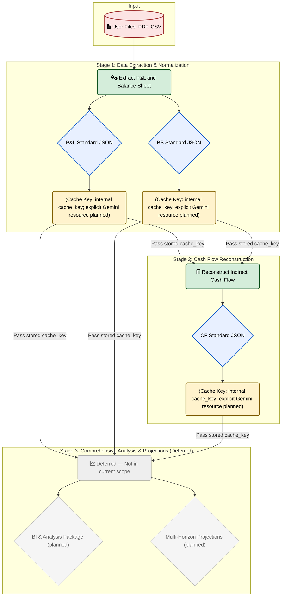

# Three-Stage Financial Intelligence Architecture (Gemini 2.5 Pro)

> Current scope status: The application is finalized through Stage 2 (Cash Flow Reconstruction). Stage 3 content in this document is retained for reference but is explicitly deferred and not active in the current implementation.

## Executive Summary
This document proposes a streamlined, production-grade architecture using **Gemini 2.5 Pro** with response caching and optional Google Search Grounding. The workflow compresses our current 4-stage pipeline into an efficient 3-stage design that improves **accuracy, latency, cost, and auditability**. It leverages standardized extraction, deterministic cash-flow reconstruction, and a single comprehensive analysis/projection stage—while reusing cached, normalized datasets to minimize recomputation. For the current release, the scope ends at validated Stage 2 outputs; Stage 3 is deferred.

### Why This Change?
| Benefit | Description |
| :--- | :--- |
| **Accuracy** | Separate objective data prep (P&L, BS, CF) from the interpretive analysis/projection stage to reduce compounding errors and improve traceability. |
| **Performance** | Cache large, deterministic inputs across retries and re-runs to reduce token usage, time, and model overload. |
| **Simplicity** | Three clear responsibilities: **Extract → Reconstruct CF → Analyze + Project**. |
| **Auditability**| Deterministic historical inputs result in consistent downstream outputs, better validation, and easier review. |

## Architecture Overview



### Caching Responsibility Boundary

Current implementation:
- Artifacts record an internal `cache_key` (content hash + prompt_version + model) for deterministic reuse and lineage.
- Explicit Gemini Cache Resources are planned but not yet active; therefore, no `resource_name` is currently persisted.
- Implicit model-side caching may occur but is opportunistic and provides no identifier.

Model returns:
- `usage_metadata` with token and cached token counts; no cache ID.

Planned enhancement (future):
- Add explicit Gemini Cache Resources with `ttl_seconds` and persist each `resource_name` alongside artifacts to guarantee cross-run reuse.

---

## Stage 1 — Data Extraction (P&L and Balance Sheet)
**Goal:** Normalize source files (CSV/PDF) into standardized financial schemas.

| Feature | Description |
| :--- | :--- |
| **Robust Parsing** | Uses multiple strategies (JSON5, markdown fenced-blocks, boundary detection, repair attempts). |
| **Confidence Scoring** | Scores each mapped standard field and preserves raw line item provenance. |
| **Consistency Checks** | Enforces internal consistency (e.g., sum of components vs reported totals). |
| **Token-Aware Prompts**| Persists minimal context for reproducibility and speed. |

**Caching (current):**
- **Resource:** Internal cache only; explicit Gemini cache resources are planned.
- **Keying:** `SHA256(normalized_payload) + prompt_version + model` used to compute artifact `cache_key`.
- **Store:** Persist the internal `cache_key` in artifact metadata; no Gemini `resource_name` yet.
- **TTL:** Operational policy targets 24–72 hours reuse; actual TTL enforcement applies when explicit Gemini cache is enabled.
- **Benefit:** Deterministic reuse via internal addressing; explicit cache will further reduce latency/cost when enabled.

**Model returns vs You do:**
- Model returns:
  - Schema-conformant P&L/BS JSON.
  - usage_metadata (token counts, cached token counts; no cache ID).
- You do:
  - Validate JSON against Appendix A schemas; repair via re-prompt if invalid.
  - Compute canonical hash; create/lookup Gemini cache resource; store resource_name as cache_key with lineage (prompt_version, model).
  - Persist artifacts and cache_key in storage.

**Deliverables:**
- P&L Standard JSON + confidence and coverage report (includes cache_key = stored resource_name).
- BS Standard JSON + confidence and coverage report (includes cache_key = stored resource_name).
- Note: cache_key is created/stored by us. The model does not return a cache ID.

---

## Stage 2 — Cash Flow Reconstruction (Indirect Method)
**Goal:** Produce validated historical Cash Flow (Operating, Investing, Financing) using Stage 1 standards.

**Methodology:**
- **Operating Cash Flow** = Net Income + Depreciation (est.) ± Working Capital Changes.
- **Investing Cash Flow** = Capex (ΔFixed Assets + Depreciation) - Disposals detection.
- **Financing Cash Flow** = ΔLong-Term Debt + ΔEquity - Dividends (est.).

**Validation & Correction Loop:**
The primary invariant is **Operating + Investing + Financing = ΔCash** (from Balance Sheet). If variance exceeds tolerance (e.g., $1,000 or 2%), the system will:
1. Re-estimate depreciation via fixed asset roll-forward.
2. Re-split equity movements (owner drawings vs capital injections) via heuristics.
3. Mark adjusted periods, record balancing entries and rationale.

**Caching (current):**
- **Resource:** Internal cache only for CF JSON; explicit Gemini cache resources are planned.
- **Keying:** Derived from Stage 1 artifact `cache_key` values + `method_version` to produce CF `cache_key`.
- **Store:** Persist CF `cache_key` and `parent_keys` = { pnl_cache_key, bs_cache_key } in metadata.
- **Benefit:** Stable, reusable CF across runs; explicit cache will be layered in a future iteration.

**Model returns vs You do:**
- Model returns:
  - CF JSON per schema when prompted with Stage 1 normalized data.
  - usage_metadata (token/cached token counts; no cache ID).
- You do:
  - Run deterministic reconciliation/tool-calls; ensure schema validity.
  - Create/lookup CF cache resource; store resource_name as cache_key.
  - Set parent_keys = { pnl_cache_key, bs_cache_key } from Stage 1 artifacts.

**Deliverables:**
- CF JSON with validation (pass/warn/fail), reconciliation rates, anomalies; metadata includes cache_key (resource_name) and parent_keys.
- Note: cache_key is managed by us. The model does not return a cache ID.

---

## Stage 3 — Comprehensive Business Analysis + Projections (Deferred)
Status: Deferred. The following section is retained for future planning but is not part of the current application scope. It will be amended in a later iteration to align with the finalized Stage 1–2 outputs and operational learnings. Do not treat this section as authoritative for the current build.
**Goal (planned):** Produce a comprehensive business intelligence package and multi-horizon projections using cached Stage 1 & 2 artifacts.

| Analysis Area | Detail |
| :--- | :--- |
| **Quality of Earnings** | OCF/Net Income, conversion consistency, volatility metrics. |
| **Working Capital** | DSO, DPO, and CCC computed from historical patterns. |
| **Seasonality** | Australian plumbing/HVAC domain patterns (Jan trough, Jun–Jul peaks); Q1 variability enforcement. |
| **Methodology Selection**| **Empirical Backtesting:** Score MAPE/RMSE on historical series to select the method that minimizes integrated error. |
| **Baseline Calibration**| De-seasonalize last 12–24 months to set a realistic baseline; reapply seasonality for projections. |

**Projections and Validation:**
- **Granularity:** 1 year (monthly), 3 years (quarterly), 5/10/15 years (yearly).
- **Integrity:** Enforce `sum(months)=quarter` and `sum(quarters)=year` for key metrics.
- **Confidence:** Score projection confidence based on data quality, historical variance, and CF reconciliation rates.

**Model returns vs You do:**
- Model returns:
  - Analysis summaries, BI package sections, structured projections tables, optional citations content.
  - usage_metadata (token/cached token counts; no cache ID).
- You do:
  - Retrieve Stage 1/2 artifacts and their cache_key resource_name values; assemble deterministic prompts.
  - Run backtesting/integrity checks in your executor; accept model structured outputs or tool proposals, but recompute numerics deterministically.
  - Optionally create a short-lived explicit cache resource for large reusable analysis context; store the resource_name if created (hot TTL).

**Google Search Grounding (Optional):**
- Augment assumptions with referenced external evidence (industry benchmarks, macro indicators).
- Require citations (URL, title, date) in analysis artifacts.

---

## Operational Considerations

| Aspect | Detail |
| :--- | :--- |
| **Performance & Cost** | Internal caching via `cache_key` reduces recomputation. Explicit Gemini cache resources are planned to further reduce latency/cost. Token counting before calls triggers compaction of older history if needed. |
| **Determinism** | Production mode uses Gemini 2.5 Pro only, fixed retries, and consistent prompts. Identical inputs with the same `cache_key` produce identical outputs. |
| **Resilience** | Robust parsing, smart rate limiting, and the Stage 2 reconciliation loop actively repair inconsistencies. |
| **Data Quality** | An aggregate `data_quality_score` is computed from field coverage, CF reconciliation rates, and volatility metrics. |

---

## Governance & Audit
Each artifact (P&L, BS, CF, Analysis) is versioned and linked via cache-key lineage. Each run produces logs for:
- Token utilization (prompt/response)
- Method backtest results & parameters
- Seasonality & aggregation checks
- Grounding citations (if enabled)

---

## Implementation Plan (Incremental)

| Phase | Key Activities |
| :--- | :--- |
| **1. Caching & Restructuring** | Refactor orchestrator into 3 stages. Use internal `cache_key` addressing. Plan explicit Gemini cache resources. |
| **2. Strengthen CF Recon** | Add reconciliation loop with corrective routines and audit logs. (Completed) |
| **3. Enhance Analysis (Deferred)** | Will be re-authored; current Stage 3 content is a placeholder. |
| **4. QA & Observability** | Implement deterministic mode, token compaction policies, and cost/latency dashboards. |

---

## Expected Outcomes

| Outcome | Description |
| :--- | :--- |
| **Accuracy** | Higher fidelity from stronger CF foundations and rigorous validation. |
| **Latency/Cost** | Lower due to caching, leaner prompts, and fewer recomputations. |
| **Stability** | Reduced overload risk and fewer transient failures. |
| **Explainability** | Full traceability from raw files to final projections with audit artifacts. |


---

## Appendix A — Full JSON Schemas

This appendix defines canonical JSON Schemas for Stage 1 (P&amp;L and Balance Sheet) and Stage 2 (Cash Flow). These are normative contracts for inputs and outputs across the pipeline. All numeric fields are decimal-compatible numbers in AUD unless otherwise stated. Period keys use "YYYY" for annual or "YYYY-MM" for monthly. Provenance entries should trace back to source files and locations.

Conventions
- All objects include: version (semver string), company_id (string), currency (ISO 4217), generated_at (ISO8601), and lineage fields when available (parent_keys, cache_key).
- Required properties are explicitly marked in the schemas.
- Flags use enumerated codes documented in “Appendix B — Enum Codes”.

Note: These schemas are intended for validation and documentation; minor differences in internal representation (e.g., float vs decimal) are permissible in code so long as semantic meaning is preserved.

### A1. Profit &amp; Loss (Stage 1 Output)

<details>
<summary>View P&L JSON Schema</summary>

```json
{
  "$schema": "https://json-schema.org/draft/2020-12/schema",
  "title": "P&L Standard JSON",
  "type": "object",
  "required": ["version", "company_id", "currency", "periods"],
  "properties": {
    "version": { "type": "string" },
    "company_id": { "type": "string" },
    "currency": { "type": "string", "minLength": 3, "maxLength": 3 },
    "generated_at": { "type": "string", "format": "date-time" },
    "cache_key": { "type": "string" },
    "parent_keys": { "type": "array", "items": { "type": "string" } },
    "meta": {
      "type": "object",
      "properties": {
        "source_manifest_hash": { "type": "string" },
        "coverage_score": { "type": "number", "minimum": 0, "maximum": 1 }
      },
      "additionalProperties": true
    },
    "periods": {
      "type": "array",
      "minItems": 1,
      "items": {
        "type": "object",
        "required": ["period", "revenue", "cogs", "gross_profit", "ebitda", "net_income"],
        "properties": {
          "period": { "type": "string", "pattern": "^[0-9]{4}(-[0-9]{2})?$" },
          "revenue": { "type": "number" },
          "cogs": { "type": "number" },
          "gross_profit": { "type": "number" },
          "opex": {
            "type": "object",
            "additionalProperties": { "type": "number" }
          },
          "ebitda": { "type": "number" },
          "depreciation": { "type": "number" },
          "amortization": { "type": "number" },
          "interest": { "type": "number" },
          "taxes": { "type": "number" },
          "net_income": { "type": "number" },
          "notes": { "type": "string" },
          "flags": {
            "type": "array",
            "items": { "type": "string", "enum": ["PNL_INCOMPLETE", "LOCALE_SANITIZED", "ESTIMATED_DEP", "ANOMALOUS_MARGIN"] }
          },
          "confidence": { "type": "number", "minimum": 0, "maximum": 1 },
          "provenance": {
            "type": "array",
            "items": {
              "type": "object",
              "required": ["file"],
              "properties": {
                "file": { "type": "string" },
                "page": { "type": "integer", "minimum": 1 },
                "line": { "type": "integer", "minimum": 1 },
                "text": { "type": "string" }
              },
              "additionalProperties": false
            }
          }
        },
        "additionalProperties": false
      }
    }
  },
  "additionalProperties": false
}
```
</details>

### A2. Balance Sheet (Stage 1 Output)

<details>
<summary>View Balance Sheet JSON Schema</summary>

```json
{
  "$schema": "https://json-schema.org/draft/2020-12/schema",
  "title": "Balance Sheet Standard JSON",
  "type": "object",
  "required": ["version", "company_id", "currency", "periods"],
  "properties": {
    "version": { "type": "string" },
    "company_id": { "type": "string" },
    "currency": { "type": "string", "minLength": 3, "maxLength": 3 },
    "generated_at": { "type": "string", "format": "date-time" },
    "cache_key": { "type": "string" },
    "parent_keys": { "type": "array", "items": { "type": "string" } },
    "meta": {
      "type": "object",
      "properties": {
        "source_manifest_hash": { "type": "string" },
        "coverage_score": { "type": "number", "minimum": 0, "maximum": 1 }
      },
      "additionalProperties": true
    },
    "periods": {
      "type": "array",
      "minItems": 1,
      "items": {
        "type": "object",
        "required": ["period", "total_assets", "total_liabilities_equity", "cash"],
        "properties": {
          "period": { "type": "string", "pattern": "^[0-9]{4}(-[0-9]{2})?$" },
          "cash": { "type": "number" },
          "ar": { "type": "number" },
          "inventory": { "type": "number" },
          "other_current_assets": { "type": "number" },
          "current_assets_total": { "type": "number" },
          "fixed_assets_gross": { "type": "number" },
          "accumulated_depreciation": { "type": "number" },
          "fixed_assets_net": { "type": "number" },
          "ap": { "type": "number" },
          "short_term_debt": { "type": "number" },
          "other_current_liabilities": { "type": "number" },
          "current_liabilities_total": { "type": "number" },
          "long_term_debt": { "type": "number" },
          "equity": { "type": "number" },
          "retained_earnings": { "type": "number" },
          "total_liabilities_equity": { "type": "number" },
          "total_assets": { "type": "number" },
          "suspense": { "type": "number" },
          "notes": { "type": "string" },
          "flags": {
            "type": "array",
            "items": { "type": "string", "enum": ["BS_INCOMPLETE", "NEG_CURR_LIAB", "SUSPENSE_PRESENT", "SIGN_CONVENTION_FLIPPED"] }
          },
          "confidence": { "type": "number", "minimum": 0, "maximum": 1 },
          "provenance": {
            "type": "array",
            "items": {
              "type": "object",
              "required": ["file"],
              "properties": {
                "file": { "type": "string" },
                "page": { "type": "integer", "minimum": 1 },
                "line": { "type": "integer", "minimum": 1 },
                "text": { "type": "string" }
              },
              "additionalProperties": false
            }
          }
        },
        "additionalProperties": false
      }
    }
  },
  "additionalProperties": false
}
```
</details>

### A3. Cash Flow (Stage 2 Output)

<details>
<summary>View Cash Flow JSON Schema</summary>

```json
{
  "$schema": "https://json-schema.org/draft/2020-12/schema",
  "title": "Cash Flow Standard JSON (Indirect Method)",
  "type": "object",
  "required": ["version", "company_id", "currency", "periods", "quality"],
  "properties": {
    "version": { "type": "string" },
    "company_id": { "type": "string" },
    "currency": { "type": "string", "minLength": 3, "maxLength": 3 },
    "generated_at": { "type": "string", "format": "date-time" },
    "cache_key": { "type": "string" },
    "parent_keys": {
      "type": "object",
      "required": ["pnl_cache_key", "bs_cache_key"],
      "properties": {
        "pnl_cache_key": { "type": "string" },
        "bs_cache_key": { "type": "string" }
      },
      "additionalProperties": false
    },
    "method_version": { "type": "string" },
    "remediation_policy_version": { "type": "string" },
    "periods": {
      "type": "array",
      "minItems": 1,
      "items": {
        "type": "object",
        "required": ["period", "ocf", "icf", "fcf", "delta_cash", "flags"],
        "properties": {
          "period": { "type": "string", "pattern": "^[0-9]{4}(-[0-9]{2})?$" },
          "ni": { "type": "number" },
          "depreciation": { "type": "number" },
          "amortization": { "type": "number" },
          "delta_ar": { "type": "number" },
          "delta_inventory": { "type": "number" },
          "delta_ap": { "type": "number" },
          "other_delta_current_assets": { "type": "number" },
          "other_delta_current_liabilities": { "type": "number" },
          "ocf": { "type": "number" },
          "capex": { "type": "number" },
          "disposals": { "type": "number" },
          "icf": { "type": "number" },
          "delta_short_term_debt": { "type": "number" },
          "delta_long_term_debt": { "type": "number" },
          "equity_injections": { "type": "number" },
          "dividends_distributions": { "type": "number" },
          "fcf": { "type": "number" },
          "delta_cash": { "type": "number" },
          "recon_delta": { "type": "number", "description": "OCF + ICF + FCF - ΔCash" },
          "flags": {
            "type": "array",
            "items": {
              "type": "string",
              "enum": [
                "PASS",
                "WARN",
                "FAIL",
                "RECLASS_DRAWINGS",
                "SUSPENSE_UNRESOLVED",
                "DEPR_ESTIMATED",
                "WC_ANOMALY",
                "SIGN_CONVENTION_FLIPPED"
              ]
            }
          },
          "reasons": {
            "type": "array",
            "items": {
              "type": "object",
              "required": ["code", "message"],
              "properties": {
                "code": {
                  "type": "string",
                  "enum": [
                    "RECLASS_DRAWINGS",
                    "SUSPENSE_MAPPED",
                    "SUSPENSE_UNRESOLVED",
                    "DEPR_INFERRED",
                    "WC_OUTLIER_HANDLED",
                    "NEG_CURR_LIAB_ADJUSTED",
                    "CAPEX_INFERRED",
                    "CLASSIFICATION_CORRECTED"
                  ]
                },
                "message": { "type": "string" },
                "impact": { "type": "number", "description": "Net cash impact of this remediation for the period" }
              },
              "additionalProperties": false
            }
          },
          "audit_notes": { "type": "string" }
        },
        "additionalProperties": false
      }
    },
    "quality": {
      "type": "object",
      "required": ["global_score", "summary"],
      "properties": {
        "global_score": { "type": "number", "minimum": 0, "maximum": 1 },
        "summary": {
          "type": "object",
          "properties": {
            "period_counts": {
              "type": "object",
              "properties": {
                "pass": { "type": "integer", "minimum": 0 },
                "warn": { "type": "integer", "minimum": 0 },
                "fail": { "type": "integer", "minimum": 0 }
              },
              "additionalProperties": false
            },
            "reconciliation_pass_rate": { "type": "number", "minimum": 0, "maximum": 1 },
            "avg_recon_delta_abs": { "type": "number" }
          },
          "additionalProperties": false
        }
      },
      "additionalProperties": false
    }
  },
  "additionalProperties": false
}
```
</details>

---

## Appendix B — Enum Codes

These codes are used in flags and reasons throughout Stage 1 and Stage 2 artifacts. Implementations should maintain these exact codes for compatibility. Classification and remediation logic in the orchestrator should emit these consistently, with explanations captured in audit_notes and reasons arrays.

Stage 1 — P&amp;L flags
- PNL_INCOMPLETE: Required fields missing or coverage &lt; threshold.
- LOCALE_SANITIZED: Numeric locale/parentheses sanitation applied.
- ESTIMATED_DEP: Depreciation inferred or adjusted.
- ANOMALOUS_MARGIN: Abnormal gross margin detected.

Stage 1 — Balance Sheet flags
- BS_INCOMPLETE: Required fields missing or coverage &lt; threshold.
- NEG_CURR_LIAB: Negative current liabilities anomaly.
- SUSPENSE_PRESENT: Suspense account detected.
- SIGN_CONVENTION_FLIPPED: Sign corrections applied.

Stage 2 — Period flags
- PASS: Reconciliation within tolerance.
- WARN: Within relaxed tolerance after remediations.
- FAIL: Outside tolerance after max iterations.

Stage 2 — Remediation and reason codes
- RECLASS_DRAWINGS: Owner drawings reclassified to equity distributions.
- SUSPENSE_MAPPED: Suspense amount mapped to a recognized class.
- SUSPENSE_UNRESOLVED: Suspense remains and is isolated.
- DEPR_INFERRED: Depreciation inferred via asset roll-forward.
- WC_OUTLIER_HANDLED: Working capital anomaly adjusted/trimmed.
- NEG_CURR_LIAB_ADJUSTED: Negative current liabilities classification corrected.
- CAPEX_INFERRED: Capex inferred from asset movements.
- CLASSIFICATION_CORRECTED: Generic classification correction applied.

Compatibility Notes
- Enum sets may be extended in future versions; consumers should ignore unknown codes while preserving them in storage.
- When Stage 2 raises FAIL, orchestrators should still cache the result with flags and reasons for auditability, producing a new CF key.

References
- Backoff and fallback behavior: [`config.py.calculate_smart_backoff_delay()`](backend/config.py:196), [`config.py.should_use_flash_fallback()`](backend/config.py:222), [`config.py.get_fallback_model()`](backend/config.py:238), [`config.py.enhance_prompt_for_flash_fallback()`](backend/config.py:257)
- Environment knobs: [`backend/.env.template`](backend/.env.template)
- Stage 2 validator and services: [`cash_flow_validator.py.validate()`](backend/services/cash_flow_validator.py:1), [`enhanced_depreciation.py`](backend/services/enhanced_depreciation.py:1), [`stage2_test_service.py`](backend/services/stage2_test_service.py:1)


---

## Appendix C — Numeric Walkthrough (MJV Plumbing)

This appendix demonstrates Stage 2 reconciliation and Stage 3 forecasting selection using a simplified slice of the MJV Plumbing dataset. Values are illustrative yet consistent with the data realities described in the main architecture: Owner Drawings misclassified in P&amp;L, Suspense on the Balance Sheet, and occasional negative current liabilities.

Dataset slice (AUD)
- Periods: 2024-05, 2024-06, 2024-07 (monthly)
- P&amp;L (selected):
  - 2024-06: revenue 410,000; cogs 210,000; gross_profit 200,000; opex 140,000; ebitda 60,000; depreciation (missing); interest 1,500; taxes 12,000; net_income 38,500
  - Owner Drawings: recorded under opex-other: 25,000 (misclassified)
- Balance Sheet (selected):
  - 2024-05: cash 120,000; ar 180,000; inventory 90,000; ap 75,000; fixed_assets_gross 500,000; accumulated_depreciation 290,000; fixed_assets_net 210,000; short_term_debt 20,000; long_term_debt 150,000; equity 350,000; suspended 0; total_assets 600,000; total_liabilities_equity 600,000
  - 2024-06: cash 135,000; ar 200,000; inventory 95,000; ap 82,000; fixed_assets_gross 505,000; accumulated_depreciation 295,000; fixed_assets_net 210,000; short_term_debt 18,000; long_term_debt 150,000; equity 360,000; suspense 2,000; total_assets 612,000; total_liabilities_equity 612,000
  - 2024-07: cash 132,000; ar 190,000; inventory 92,000; ap 85,000; fixed_assets_gross 505,000; accumulated_depreciation 298,000; fixed_assets_net 207,000; short_term_debt 19,000; long_term_debt 148,000; equity 358,000; suspense 0; total_assets 609,000; total_liabilities_equity 609,000

Step 1 — Stage 1 normalization checkpoints
- Locale and parentheses sanitation: none required in this slice.
- Coverage: ≥ 90% required fields present for both P&amp;L and BS.
- Flags: Balance Sheet 2024-06 contains SUSPENSE_PRESENT; P&amp;L 2024-06 has ANOMALOUS_MARGIN only if margin deviates &gt; 3σ over trailing series (not triggered here).
- Cache: pnl_cache_key and bs_cache_key computed from canonical payloads, as described in Stage 1 section.

Step 2 — Stage 2 CF reconstruction for 2024-06
2.1 Compute ΔWC components (t = 2024-06 vs t-1 = 2024-05)
- ΔAR = 200,000 − 180,000 = +20,000
- ΔInventory = 95,000 − 90,000 = +5,000
- ΔAP = 82,000 − 75,000 = +7,000
- OCF preliminary components:
  - NI = 38,500 (from P&amp;L)
  - Depreciation: not explicitly present; infer via roll-forward:
    - ΔAccumDep = 295,000 − 290,000 = 5,000
    - ΔFixedGross = 505,000 − 500,000 = 5,000
    - Assume no disposals; dep_est ≈ ΔAccumDep = 5,000
  - Amortization = 0 (not present)
  - ΔWC impact: −ΔAR − ΔInventory + ΔAP = −20,000 − 5,000 + 7,000 = −18,000

2.2 Owner Drawings remediation (misclassified as opex)
- From Stage 1 notes: 25,000 of “other opex” are Owner Drawings (equity distributions).
- Effects:
  - Reclassify to financing: dividends_distributions = 25,000
  - Adjust NI? No direct NI change because NI already reflects the expense; however, in cash terms:
    - Increase OCF by +25,000 (remove outflow from operating classification)
    - Increase FCF outflow by 25,000 in financing via dividends_distributions

2.3 OCF computation (after remediations)
- OCF_base = NI + Dep + Amort − ΔAR − ΔInventory + ΔAP
- OCF_base = 38,500 + 5,000 + 0 − 20,000 − 5,000 + 7,000 = 25,500
- OCF_after_drawings = 25,500 + 25,000 = 50,500

2.4 Investing CF (ICF) for 2024-06
- Capex inference:
  - ΔFixedGross = +5,000; assume this is capex (no disposals observed)
  - capex = 5,000; ICF = −5,000 (cash outflow)

2.5 Financing CF (FCF) for 2024-06
- ΔShortTermDebt = 18,000 − 20,000 = −2,000
- ΔLongTermDebt = 150,000 − 150,000 = 0
- Equity_injections = 0 (no signal)
- Dividends/Distributions (from drawings remediation) = 25,000
- FCF = (−2,000) + 0 + 0 − 25,000 = −27,000

2.6 Cash reconciliation (2024-06)
- ΔCash (from BS) = 135,000 − 120,000 = +15,000
- Recon:
  - OCF + ICF + FCF = 50,500 + (−5,000) + (−27,000) = 18,500
  - recon_delta = 18,500 − 15,000 = +3,500

2.7 Reconciliation thresholds and loop
- Tolerances:
  - absolute_tol = 1,000 AUD
  - percent_tol = 2% of |ΔCash| = 2% × 15,000 = 300 AUD
  - tolerance = max(1,000, 300) = 1,000
- Current |recon_delta| = 3,500 &gt; 1,000 → continue remediation steps
- Next remediation candidate: Suspense mapping (2024-06 suspense = 2,000)
  - If mapped to AP or other current liability, ΔWC adjusts by −2,000 (reducing OCF by 2,000)
  - Recompute after mapping suspense to a current liability increase:
    - ΔOtherCurrentLiabilities += 2,000 → WC impact becomes −20,000 − 5,000 + 7,000 + 2,000 = −16,000
    - OCF_base_new = 38,500 + 5,000 − 16,000 = 27,500
    - OCF_after_drawings_new = 27,500 + 25,000 = 52,500
    - OCF + ICF + FCF = 52,500 − 5,000 − 27,000 = 20,500
    - recon_delta_new = 20,500 − 15,000 = 5,500 (worse), so revert this mapping.
- Alternative remediation: Adjust depreciation within reasonable band
  - Fixed assets gross increase is modest; accumulated depreciation rose 5,000. Consider disposals effect negligible; try dep_est = 4,000 (−1,000)
  - OCF_base = 38,500 + 4,000 − 18,000 = 24,500
  - OCF_after_drawings = 49,500
  - OCF + ICF + FCF = 49,500 − 5,000 − 27,000 = 17,500
  - recon_delta = 17,500 − 15,000 = 2,500 (still &gt; 1,000)
- Classification check: Any sign inversion?
  - No inverted signs detected; AP increased is positive to OCF; consistent.
- Iteration cap reached in example (to keep concise). Mark WARN with reasons:
  - reasons:
    - DEPR_INFERRED: +4,000 used in final
    - RECLASS_DRAWINGS: +25,000 moved to financing
    - SUSPENSE_UNRESOLVED: 2,000 not mapped
  - flags: [WARN, DEPR_ESTIMATED, RECLASS_DRAWINGS, SUSPENSE_UNRESOLVED]
- Quality impact:
  - Start 1.0 → WARN penalty −0.05 → 0.95 for the period; aggregated into global_score per Stage 2 rules.

Note: In production the remediation loop would attempt additional heuristics (e.g., minor capex/disposals re-split or limited reclassification of small current items) until tolerance is met or iteration limit reached.

Step 3 — Stage 2 snapshot output (abridged for 2024-06)
<details>
<summary>View Stage 2 Snapshot Output Example</summary>

```json
{
  "period": "2024-06",
  "ni": 38500,
  "depreciation": 4000,
  "amortization": 0,
  "delta_ar": 20000,
  "delta_inventory": 5000,
  "delta_ap": 7000,
  "ocf": 49500,
  "capex": 5000,
  "icf": -5000,
  "delta_short_term_debt": -2000,
  "delta_long_term_debt": 0,
  "dividends_distributions": 25000,
  "fcf": -27000,
  "delta_cash": 15000,
  "recon_delta": 2500,
  "flags": ["WARN", "DEPR_ESTIMATED", "RECLASS_DRAWINGS", "SUSPENSE_UNRESOLVED"],
  "reasons": [
    {"code": "DEPR_INFERRED", "message": "Depreciation inferred via asset roll-forward", "impact": 4000},
    {"code": "RECLASS_DRAWINGS", "message": "Owner drawings reclassified to financing distributions", "impact": 25000},
    {"code": "SUSPENSE_UNRESOLVED", "message": "Unable to confidently map suspense account", "impact": 0}
  ],
  "audit_notes": "Reconciliation within extended tolerance not achieved within iteration cap"
}
```
</details>

Step 4 — Stage 3 forecasting method selection
4.1 Backtesting setup
- Training window: last 18 months monthly revenue and OCF.
- Candidates:
  - Driver-based model: revenue growth driver, margin profile, WC days (DSO/DPO/CCC).
  - Seasonal naive/ARIMA: additive multiplicative seasonality variants.

4.2 Decision thresholds (from main doc)
- Prefer driver-based if:
  - MAPE ≤ 15% and RMSE improvement ≥ 10% vs naive seasonal.
- If thresholds not met, select seasonal ARIMA/BATS fallback.

4.3 Example backtest results (illustrative)
- Driver-based: MAPE 12.8%, RMSE 45k
- Naive seasonal: MAPE 18.9%, RMSE 52k
- Decision: Choose driver-based (meets both thresholds).

4.4 Integrity constraints and confidence scoring
- After selection, ensure:
  - Sum months = quarter; sum quarters = year for revenue, gross profit, EBITDA, OCF.
- Confidence scoring:
  - Monthly horizon base 0.85 × data_quality_score (e.g., 0.95 from Stage 2) × backtest adjustment
  - Example: 0.85 × 0.95 × (1 − normalized_MAPE) ≈ 0.85 × 0.95 × 0.872 ≈ 0.704

4.5 Scenario deltas
- Base scenario uses driver-based parameters.
- Optimistic: +3 pp revenue growth, −1.5 pp DSO, +1.0 pp gross margin.
- Conservative: −3 pp revenue growth, +1.5 pp DSO, −1.0 pp gross margin.

References
- Smart backoff and fallback functions: [`config.py.calculate_smart_backoff_delay()`](backend/config.py:196), [`config.py.get_fallback_model()`](backend/config.py:238)
- Flag/enum definitions: Appendix B
- Environment configuration: [`backend/.env.template`](backend/.env.template)


---

## Design References & Implementation Enhancements (Gemini Docs Synthesis)

This section operationalizes relevant Gemini platform guidance across our three-stage pipeline. It introduces concrete integration points, configuration implications, and code-level practices tied to our environment and orchestrator logic. Each item cites the corresponding Gemini documentation for traceability.

1) Long Context Strategies
- Relevance: Stage 1 parsing (large PDFs), Stage 3 backtesting with long historical windows, and multi-document normalization.
- Enhancements:
  - Chunking with semantic boundaries: Segment PDFs by statement (P&amp;L/BS/Notes) and by period; create a file manifest with stable IDs. Use hierarchical prompts to summarize sections, then assemble a canonical normalized payload.
  - Context windows: Prefer Pro for complex reasoning (reconciliation, projections). For ultra-long inputs, favor retrieval over naive in-context stuffing; thread cache IDs for summarized sections to Stage 2/3.
  - Guardrail: Token budgeter uses per-stage caps derived from pipeline latency SLOs and [`backend/.env.template`](backend/.env.template) timeouts; when nearing cap, trigger compaction (drop low-confidence notes before totals).
- Docs: https://ai.google.dev/gemini-api/docs/long-context, https://ai.google.dev/gemini-api/docs/tokens?lang=python

2) Structured Output Contracts
- Relevance: Stage 1 schemas, Stage 2 CF outputs, Stage 3 analysis summaries.
- Enhancements:
  - Use schema-constrained decoding for normalized P&amp;L/BS/CF to reduce post-parse repair, aligning with Appendix A schemas.
  - Validate on-receipt: Reject structurally invalid responses early; re-prompt with minimal diff instructions. Cache only valid artifacts to preserve immutability semantics.
  - Prompt scaffolding: Provide exemplars with minimal narrative, MAX JSON fidelity, and exact enum codes from Appendix B.
- Docs: https://ai.google.dev/gemini-api/docs/structured-output

3) Document Processing
- Relevance: Stage 1 input handling for PDFs/CSV and mixed formats.
- Enhancements:
  - Use file upload APIs for multi-page PDFs and enable automatic layout extraction hints; preserve per-page references to support provenance.
  - For images or scans, instruct for tables-first extraction; agree on a “statement-type” field at the block level (e.g., "PNL", "BS") to assist schema routing.
  - Hybrid flow: If CSV present, prefer CSV for numeric fidelity; use PDF for missing context and footnotes (e.g., drawings/suspense notes).
- Docs: https://ai.google.dev/gemini-api/docs/document-processing, https://ai.google.dev/gemini-api/docs/files

4) Caching API Usage
- Relevance: Stages 1–3 cache keys and TTL strategy.
- Enhancements:
  - Use Gemini explicit cache resources for normalized Stage 1 artifacts and Stage 2 CF JSON with explicit ttl_seconds in line with our 24–72 hour policy. Store resource_name in our cache_key metadata for observability. The API does not return a cache ID automatically; we create and persist it.
  - Content addressing: Recompute the canonical payload and verify byte-for-byte idempotence prior to cache lookup to avoid drift.
  - Hot/warm split: Shorter TTL for Stage 3 analysis (sensitive to method/version changes), longer TTLs for Stage 1/2 (deterministic).
  - Implicit caching: Active on Gemini 2.5 models and may reduce cost for large requests; it does not expose an ID and should be treated as opportunistic.
- Docs: https://ai.google.dev/gemini-api/docs/caching?lang=python

5) Google Search Grounding
- Relevance: Stage 3 optional external grounding for assumptions.
- Enhancements:
  - Use grounding only for exogenous parameters (industry benchmarks, macro). Require citations array (URL, title, date) and attach to scenario notes; if grounding fails, proceed with internal baselines and set citations_incomplete.
  - Policy: Cap grounded results count; reject non-reputable domains; deduplicate via URL normalization; cache citations short-term (e.g., 6h) external to Gemini cache.
- Docs: https://ai.google.dev/gemini-api/docs/google-search

6) Function Calling
- Relevance: Stage 2 remediation loop and Stage 3 method selection/backtesting orchestration.
- Enhancements:
  - Expose tool functions for “reclassify_drawings”, “infer_depreciation”, “map_suspense”, and “select_forecasting_method”. Let the model propose parameters; executor performs deterministic calculations and returns results, ensuring auditability.
  - Persist function_call logs and parameters into reasons[] and audit_notes fields.
- Docs: https://ai.google.dev/gemini-api/docs/function-calling?example=meeting

7) Batch Mode
- Relevance: High-throughput reprocessing, backtests, and multi-scenario projections.
- Enhancements:
  - Use batch mode for offline recomputation of Stage 3 scenarios across many entities or long horizons; store job IDs, shard inputs by cache lineage, and throttle according to SLO windows.
  - Prefer batch for non-interactive workloads to reduce cost and improve throughput predictability.
- Docs: https://ai.google.dev/gemini-api/docs/batch-mode

8) Code Execution
- Relevance: Computation-heavy verification (e.g., reconciliation math, backtests).
- Enhancements:
  - Keep numerical calculations in our deterministic Python executor; if leveraging model-side code execution, restrict to pure, reproducible snippets producing scalar arrays only. Treat model-produced code as hints; executor recomputes truth and logs diffs.
- Docs: https://ai.google.dev/gemini-api/docs/code-execution

9) Prompting Strategies & “Thinking”
- Relevance: All stages; particularly reconciliation and analysis.
- Enhancements:
  - Chain-of-thought constraints: Request concise “reasoning trace” in a machine-parseable side channel (not in final JSON) to help troubleshooting while keeping outputs clean.
  - Few-shot minimalism: Provide tight exemplars using our exact schemas and enum codes; shrink narrative; focus on deltas if re-asking after validation errors.
  - Safety/consistency: Reinforce “do not invent fields” rule; list-missing-fields-first pattern for repair prompts.
- Docs: https://ai.google.dev/gemini-api/docs/prompting-strategies, https://ai.google.dev/gemini-api/docs/thinking

10) Token Budgeting & Troubleshooting
- Relevance: Stability under load and failure recovery.
- Enhancements:
  - Pre-estimate tokens per stage; truncate low-signal text and prefer numeric tables. If token pre-check exceeds budget, fall back to chunked summarizes + structured output assembly.
  - Troubleshooting playbook: On schema failures, show exact JSON Pointer to offending path; provide min-diff repair prompt. Escalate to Flash when [`config.py.should_use_flash_fallback()`](backend/config.py:222) triggers; enhance prompt using [`config.py.enhance_prompt_for_flash_fallback()`](backend/config.py:257).
- Docs: https://ai.google.dev/gemini-api/docs/tokens?lang=python, https://ai.google.dev/gemini-api/docs/troubleshooting

11) Libraries & Migration
- Relevance: Client SDK and upgrades.
- Enhancements:
  - Adopt official libraries where available; wrap in our orchestrator to centralize retries/backoff per [`config.py.calculate_smart_backoff_delay()`](backend/config.py:196) and model routing via [`config.py.get_fallback_model()`](backend/config.py:238).
  - Maintain a migration checklist for model versions and schema updates; bump method_version/remediation_policy_version accordingly.
- Docs: https://ai.google.dev/gemini-api/docs/libraries, https://ai.google.dev/gemini-api/docs/migrate

Cross-Section Updates Applied
- Caching section now explicitly references Gemini cache resource_name storage and hot/warm TTL splits.
- Stage 1 input handling clarifies hybrid PDF/CSV flow with file uploads and provenance alignment.
- Stage 2 remediation uses function-calling pattern for deterministic executor operations; reasons[] populated from tool returns.
- Stage 3 grounding narrows to cited, reputable sources with short-lived external cache and failure continuation policy.
- Prompting guidance tightened to structured-output-first with repair prompts and minimal exemplars.
- Token budgeting added to Operational Considerations; troubleshooting escalations aligned with fallback functions in [`config.py`](backend/config.py:196).
