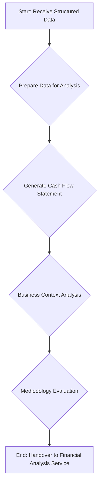

# Cash Flow Service

The Cash Flow Service is the second stage in the analysis pipeline, responsible for generating a cash flow statement and conducting an initial business analysis. This service takes the structured data from the Extraction Service and transforms it into a format that can be used for deeper financial analysis.

## Key Responsibilities

The following diagram illustrates the key responsibilities of the Cash Flow Service:

### 1. Data Preparation

The service begins by preparing the data from the Extraction Service for analysis. This involves:

-   Aggregating the standard field mappings from all uploaded documents.
-   Combining the raw extracted data into a single data structure.

### 2. Cash Flow Generation

The primary responsibility of this service is to generate a cash flow statement. It sends the prepared data to the **Google Gemini Pro** model with a prompt that instructs it to:

-   Reconstruct a cash flow statement from the provided profit and loss and balance sheet data.
-   Analyze the cash flow to identify key trends and patterns.

### 3. Business Context Analysis

In addition to generating the cash flow statement, the service also performs an initial business analysis. This includes identifying:

-   **Industry Classification**: The industry in which the business operates.
-   **Business Stage**: The current stage of the business (e.g., "Growth," "Mature," "Startup").
-   **Market Geography**: The geographical market in which the business operates.
-   **Competitive Position**: The company's position relative to its competitors.

### 4. Methodology Evaluation

The service evaluates and selects the most appropriate methodology for the subsequent financial analysis and projections. It uses an `IntelligentMethodologySelector` to determine the best approach based on the characteristics of the provided data.

### 5. Handover to Financial Analysis Service

The final output of the Cash Flow Service is a comprehensive data structure that includes the generated cash flow statement, the business context analysis, and the selected methodology. This data is then passed to the Financial Analysis Service for the next stage of the analysis.