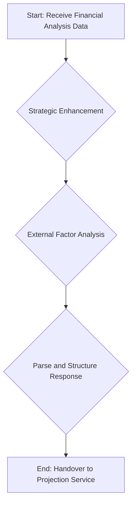

# Enhancement Service

The Enhancement Service is stage 3.5 in the analysis pipeline, responsible for enriching the comprehensive business analysis with strategic insights and external factor analysis. This service takes the data from the Financial Analysis Service and adds a layer of qualitative analysis to provide a more holistic view of the business.

## Key Responsibilities

The following diagram illustrates the key responsibilities of the Enhancement Service:

### 1. Strategic Enhancement

The service sends the comprehensive analysis from the previous stage to the **Google Gemini Pro** model. The model is prompted to enhance the analysis by:

-   Identifying strategic opportunities and risks.
-   Providing recommendations for business improvement.
-   Assessing the company's overall strategic positioning.

### 2. External Factor Analysis

A key function of this service is to consider external factors that may impact the business. This includes analyzing:

-   **Market Trends**: Identifying key trends in the industry and the broader market.
-   **Economic Conditions**: Assessing the impact of macroeconomic factors on the business.
-   **Competitive Landscape**: Analyzing the competitive environment and the company's position within it.

### 3. Parse and Structure Response

The service uses a `SuperRobustJSONParser` to parse the response from the Gemini Pro model. This ensures that the qualitative insights are structured in a consistent and usable format.

### 4. Handover to Projection Service

The final output of the Enhancement Service is a data structure containing the enriched analysis and strategic insights. This is then passed to the Projection Service, which uses this information to generate more accurate and context-aware financial projections.