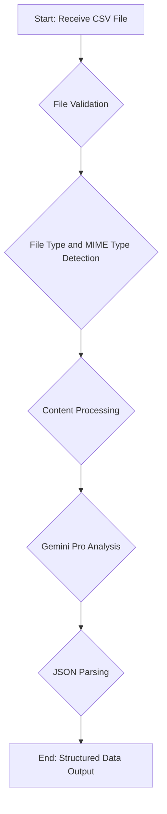

# Extraction Service

The Extraction Service is the first stage in the analysis pipeline, responsible for processing the raw data from the uploaded `CSV` files. This service validates the files, identifies the document type, and extracts the financial data into a structured format that can be used by the other services.

## Key Responsibilities

The following diagram outlines the key responsibilities of the Extraction Service:

### 1. File Validation

The service begins by validating the uploaded file to ensure it meets the system's requirements. This includes checking:

-   **File Existence**: Ensures that a file has been provided.
-   **File Content**: Verifies that the file is not empty.
-   **File Size**: Enforces the maximum file size limits (25MB for `CSV` files).

### 2. File Type and MIME Type Detection

The service determines the file type and MIME type based on the file extension. This is a critical step to ensure that the file is a `CSV` and can be processed correctly.

### 3. Content Processing

For `CSV` files, the service reads the content and decodes it into a text format. It attempts to use several common encodings (`UTF-8`, `Latin-1`, etc.) to ensure compatibility with different file formats.

### 4. Document Type Detection

A key function of this service is to identify the type of financial document contained in the file. It uses a fallback mechanism that:

-   Examines the filename for keywords such as "profit," "loss," "balance," or "cash flow."
-   Scans the content of the file for common financial terms to infer the document type.

### 5. Analysis with Gemini Pro

The service sends the processed content to the **Google Gemini Pro** model for analysis. The model is prompted to extract the financial data and return it in a structured `JSON` format. This includes:

-   Identifying the document type.
-   Extracting key financial metrics.
-   Assessing the quality of the data.

### 6. JSON Parsing and Response

The service includes an enhanced `JSON` parser to handle the response from the Gemini Pro model. This parser is designed to be resilient and can handle various `JSON` formats, including those with minor errors. If the `JSON` response is successfully parsed, the service returns a structured data object. If parsing fails, it provides a fallback response that includes the raw data and any detected document type.

The final output of the Extraction Service is a standardized data structure that is passed to the Orchestration Service for the next stage of the analysis.