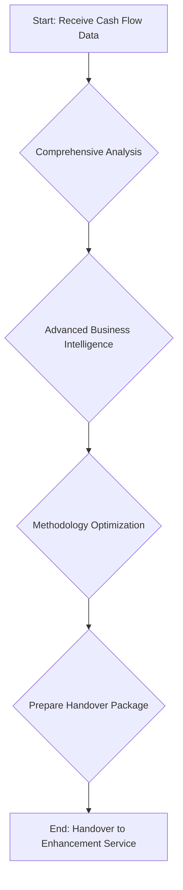

# Financial Analysis Service

The Financial Analysis Service is the third stage in the analysis pipeline, responsible for conducting a comprehensive analysis of the company's financial health. This service takes the data from the Cash Flow Service and performs a deep dive into the financial data to identify key insights and prepare for the final projection stage.

## Key Responsibilities

The following diagram illustrates the key responsibilities of the Financial Analysis Service:

### 1. Comprehensive Analysis

The service sends the data from the Cash Flow Service to the **Google Gemini Pro** model with a prompt that instructs it to perform a comprehensive business analysis. This includes:

-   Validating the industry classification.
-   Enhancing the competitive position analysis.
-   Analyzing the business model.

### 2. Advanced Business Intelligence

The service extracts advanced business intelligence from the analysis, including:

-   **Final Industry Classification**: A confirmed classification of the company's industry.
-   **Enhanced Competitive Position**: A more detailed analysis of the company's market position.
-   **Confirmed Business Model**: A validated analysis of the company's business model.

### 3. Methodology Optimization

A critical function of this service is to optimize the methodology for the final projections. It uses an `IntelligentMethodologySelector` to:

-   Select the primary forecasting method (e.g., "ARIMA," "Linear Regression").
-   Provide a rationale for the selected method.
-   Determine a confidence level for the chosen methodology.

### 4. Handover Package Preparation

The service prepares a handover package for the next stage of the analysis. This package includes:

-   The complete historical financial data.
-   The selected methodology and its parameters.
-   The comprehensive business intelligence analysis.

The final output of the Financial Analysis Service is a detailed analysis and a set of recommendations that are passed to the Enhancement Service for further refinement.