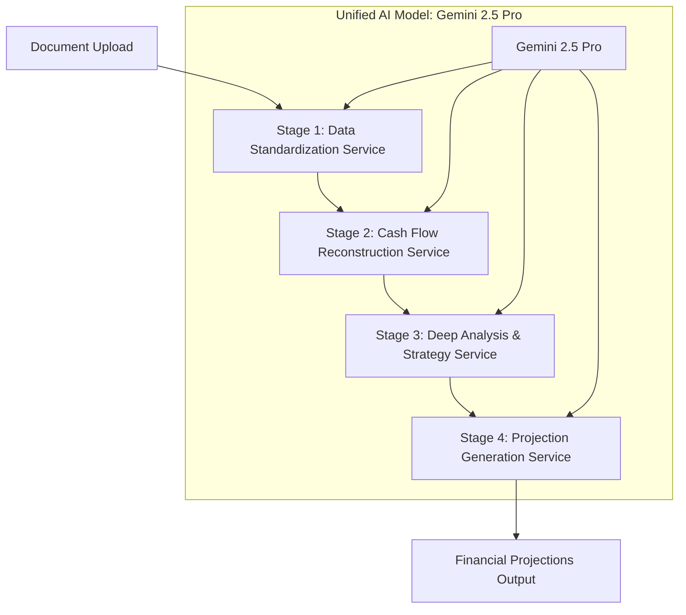

# OCR-Based Financial Projection System - Overview

## System Architecture

The OCR-Based Financial Projection System is a sophisticated **4-stage modular architecture** designed to perform deep financial analysis and generate comprehensive financial forecasts. The system uses a **unified AI model strategy**, leveraging `gemini-2.5-pro` across all stages for maximum analytical depth and consistency.

### Core Components


```mermaid
graph TD
    A[Document Upload] --> B[Stage 1: Data Standardization Service];
    B --> C[Stage 2: Cash Flow Reconstruction Service];
    C --> D[Stage 3: Deep Analysis & Strategy Service];
    D --> E[Stage 4: Projection Generation Service];
    E --> F[Financial Projections Output];
    
    subgraph "Unified AI Model: Gemini 2.5 Pro"
        G[Gemini 2.5 Pro] --> B;
        G --> C;
        G --> D;
        G --> E;
    end
```

## Four-Stage Architecture

### Stage 1: Data Extraction & Standardization
- **Service**: `OCRService`
- **Model**: Gemini 2.5 Pro
- **Purpose**: Extract all financial data and map it to **25 guaranteed standard fields** (P&L and Balance Sheet).
- **Output**: A consistent, standardized financial dataset.

### Stage 2: Historical Cash Flow Reconstruction
- **Service**: `BusinessAnalysisService`  
- **Model**: Gemini 2.5 Pro
- **Purpose**: Generate a historical Cash Flow statement using the indirect method from Stage 1's data. Calculates **actual, data-driven working capital drivers** (DSO, DPO, etc.).
- **Output**: A complete 3-statement historical financial view of the business.

### Stage 3: Deep Analysis & Forecasting Strategy
- **Service**: `AnalysisService`
- **Model**: Gemini 2.5 Pro
- **Purpose**: Perform deep analysis on the complete 3-statement history to validate the business model, assess cash-constrained growth, and select the optimal, integrated forecasting methodology.
- **Output**: A definitive forecasting strategy with validated, data-driven assumptions.

### Stage 4: Projection Generation
- **Service**: `ProjectionService`
- **Model**: Gemini 2.5 Pro
- **Purpose**: Generate final, multi-horizon financial projections for key metrics (Revenue, Expenses, Gross Profit, Net Profit).
- **Output**: Multi-horizon projections with scenarios.

## Key Features

### 🎯 Unified Pro Model Architecture
- **Consistent Power**: Uses `gemini-2.5-pro` for all stages, from extraction to projection, ensuring high-quality analysis throughout.
- **Optimized Rate Limiting**: A smart, centralized service (`multi_pdf_service`) manages API calls to prevent overloads and ensure stability without excessive delays.
- **Concurrency Control**: A semaphore system ensures that intensive Pro model calls are processed sequentially and efficiently.

### 📊 Multi-Format Support
- **PDFs**: Financial statements, reports
- **CSVs**: Tabular financial data

### 🇦🇺 Australian Business Focus
- **Financial Year**: July-June cycles (FY2025 = July 1, 2024 to June 30, 2025)
- **Market Context**: Australian business patterns and regulations
- **Currency**: AUD-focused with multi-currency support

### 📈 Advanced Forecasting
- **Data-Driven Assumptions**: Projections are based on **actual historical working capital drivers**, not generic industry averages.
- **Time Horizons**: 1, 3, 5, 10, and 15-year projections.
- **Granularity**: Monthly → Quarterly → Yearly aggregation.
- **Scenarios**: Optimistic, Base Case, Conservative.

## Technical Architecture

### Service Layer
```typescript
interface ServiceArchitecture {
  stage1: OCRService;           // Data Standardization
  stage2: BusinessAnalysisService; // Cash Flow Reconstruction
  stage3: AnalysisService;         // Deep Analysis & Strategy
  stage4: ProjectionService;    // Financial Projections
}
```

### Model Strategy
- **Unified Model**: Gemini 2.5 Pro is used for all stages to ensure consistency and analytical depth.
- **Intelligent Fallbacks**: The system uses a `SuperRobustJSONParser` and `IntelligentMethodologySelector` to handle potential API response issues gracefully.

### Concurrency Control
- **Pro Model Semaphore**: Limits concurrent Pro model calls to one at a time across the entire application.
- **Smart Rate Limiting**: Dynamic delays (12s standard, 20s on error, 45s on overload) prevent API issues without unnecessary waiting.
- **API Key Rotation**: Distributes load across multiple API keys.

## Data Flow

### 1. Input Processing
```python
files_data: List[Tuple[str, bytes]] → validation → type_detection
```

### 2. Stage 1: Standardization
```python
documents → OCRService → standardized_pl_and_bs_data
```

### 3. Stage 2: Cash Flow Reconstruction  
```python
standardized_data → BusinessAnalysisService → complete_3_statement_historicals
```

### 4. Stage 3: Deep Analysis
```python
historical_3_statements → AnalysisService → forecasting_strategy_and_assumptions
```

### 5. Stage 4: Projections
```python
strategy_and_assumptions → ProjectionService → final_financial_forecasts
```

## Output Structure

### Financial Statements
- **Current Focus**: Projections for **Revenue, Expenses, Gross Profit, and Net Profit**.
- **Future Capability**: The architecture is built to support full 3-way forecasting (P&L, Cash Flow, Balance Sheet) in the future.

### Projection Horizons
- **1 Year**: Monthly granularity (12 data points)
- **3 Years**: Quarterly granularity (12 data points)
- **5 Years**: Yearly granularity (5 data points)
- **10 Years**: Yearly granularity (10 data points)
- **15 Years**: Yearly granularity (15 data points)

### Business Intelligence
- **Industry Classification**: Automated business categorization.
- **Cash Flow Health**: Analysis of cash generation vs. profitability.
- **Working Capital Efficiency**: Actual, calculated DSO, DPO, and Cash Conversion Cycle.
- **Risk Factors**: Identified business and financial risks.
- **Assumptions**: Detailed, justified forecasting assumptions based on the company's own historical data.

## Quality Assurance

### Validation Layers
1. **File Validation**: Size, format, content validation.
2. **Data Quality (Stage 1)**: Completeness of standard field mapping, consistency, anomaly detection.
3. **Cash Flow Reconciliation (Stage 2)**: Validates that the reconstructed cash flow matches the change in cash on the balance sheet.
4. **Business Logic (Stage 3)**: AI-powered semantic validation of assumptions and strategy.
5. **Projection Completeness (Stage 4)**: Ensures all required metrics and time horizons are generated.

### Error Handling
- **Graceful Degradation**: `SuperRobustJSONParser` and `IntelligentMethodologySelector` provide fallbacks for partial failures.
- **Retry Logic**: Automatic retry with smart exponential backoff.
- **Timeout Management**: A 20-minute overall process timeout protects against hangs.
- **Logging**: Comprehensive logging for debugging and monitoring.

## Performance Characteristics

### Scalability
- **Sequential Pro Model Calls**: The 4-stage process runs sequentially to build context, managed by the smart rate-limiter.
- **Resource Management**: Intelligent API quota distribution and key rotation.
- **Timeout Controls**: Configurable process timeouts (default: 20 minutes).

### Reliability
- **Unified Model**: Reduces complexity and potential for cross-model compatibility issues.
- **Robust JSON Parsing**: Multiple parsing strategies handle malformed API responses.
- **Comprehensive Logging**: Detailed operational visibility.

## Next Steps

This overview provides the foundation for understanding the system. The following sections will dive deep into each component:

- **Stage 1**: Data Extraction & Standardization
- **Stage 2**: Cash Flow Reconstruction & Business Analysis
- **Stage 3**: Deep Analysis & Forecasting Strategy
- **Stage 4**: Projection Generation
- **API Reference**: Usage examples and integration guide
- **Configuration**: Setup and customization options 