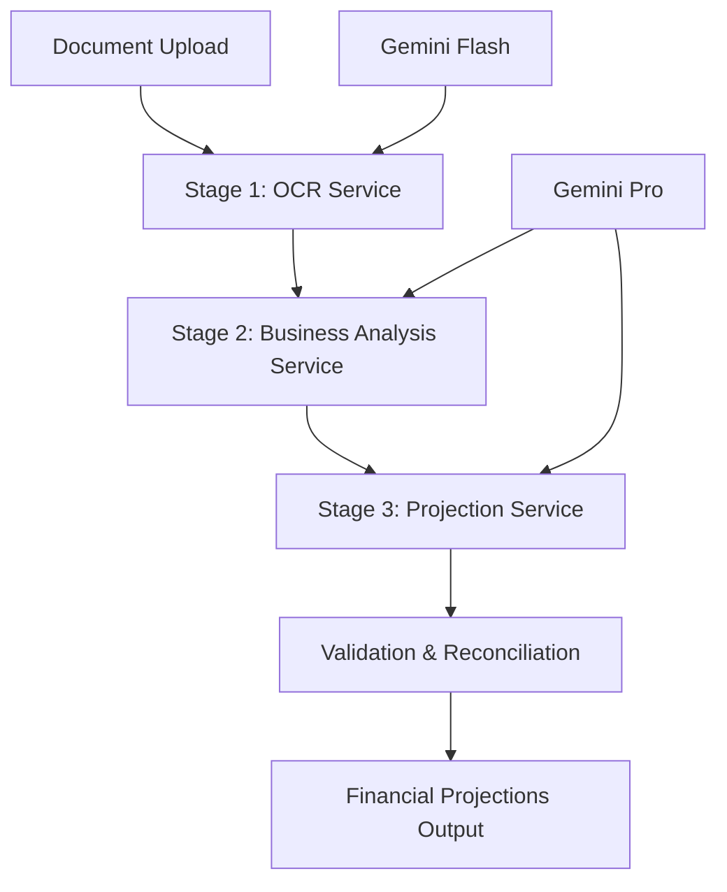

# OCR-Based Financial Projection System - Overview

## System Architecture

The OCR-Based Financial Projection System is a sophisticated 3-stage modular architecture designed to extract financial data from documents and generate comprehensive financial forecasts. The system leverages AI models for intelligent document processing and advanced forecasting methodologies.

### Core Components



## Three-Stage Architecture

### Stage 1: Data Extraction & Normalization
- **Service**: `OCRService`
- **Model**: Gemini 2.5 Flash (optimized for high-volume extraction)
- **Purpose**: Extract, normalize, and assess quality of financial data
- **Output**: Structured financial data with quality metrics

### Stage 2: Business Analysis & Methodology Selection
- **Service**: `BusinessAnalysisService`  
- **Model**: Gemini 2.5 Pro (complex reasoning)
- **Purpose**: Analyze business context and select optimal forecasting methodology
- **Output**: Business intelligence and forecasting strategy

### Stage 3: Projection Engine
- **Service**: `ProjectionService`
- **Model**: Gemini 2.5 Pro (complex financial modeling)
- **Purpose**: Generate comprehensive 3-way financial forecasts
- **Output**: Multi-horizon projections with scenarios

## Key Features

### 🎯 Tiered Model Selection
- **Flash Model**: Used for data extraction (higher quotas, faster processing)
- **Pro Model**: Used for complex analysis and projections (deeper reasoning)
- **Concurrency Control**: Semaphore-based Pro model quota management

### 📊 Multi-Format Support
- **PDFs**: Financial statements, reports
- **CSVs**: Tabular financial data
- **Images**: Scanned documents (PNG, JPG, etc.)

### 🇦🇺 Australian Business Focus
- **Financial Year**: July-June cycles (FY2025 = July 1, 2024 to June 30, 2025)
- **Market Context**: Australian business patterns and regulations
- **Currency**: AUD-focused with multi-currency support

### 📈 Advanced Forecasting
- **Time Horizons**: 1, 3, 5, 10, and 15-year projections
- **Granularity**: Monthly → Quarterly → Yearly aggregation
- **Methodologies**: ARIMA, Prophet, Linear Regression, Exponential Smoothing
- **Scenarios**: Optimistic, Base Case, Conservative

## Technical Architecture

### Service Layer
```typescript
interface ServiceArchitecture {
  stage1: OCRService;           // Data extraction
  stage2: BusinessAnalysisService; // Business analysis  
  stage3: ProjectionService;    // Financial projections
}
```

### Model Strategy
- **Extraction**: Gemini 2.5 Flash for high-volume document processing
- **Analysis**: Gemini 2.5 Pro for complex business reasoning
- **Validation**: Local algorithms + AI semantic checks

### Concurrency Control
- **Pro Model Semaphore**: Limits concurrent Pro model calls (default: 3)
- **API Key Rotation**: Distributed load across multiple API keys
- **Timeout Management**: Configurable timeouts with retry logic

## Data Flow

### 1. Input Processing
```python
files_data: List[Tuple[str, bytes]] → validation → type_detection
```

### 2. Stage 1: Extraction
```python
documents → OCRService → structured_data + quality_metrics
```

### 3. Stage 2: Analysis  
```python
structured_data → BusinessAnalysisService → business_context + methodology
```

### 4. Stage 3: Projections
```python
business_context → ProjectionService → financial_forecasts
```

### 5. Validation
```python
financial_forecasts → ValidationEngine → validated_projections
```

## Output Structure

### Financial Statements
- **Profit & Loss**: Complete P&L with calculation chains
- **Cash Flow**: Operating, Investing, Financing activities
- **Balance Sheet**: Assets, Liabilities, Equity (always balanced)

### Projection Horizons
- **1 Year**: Monthly granularity (12 data points)
- **3 Years**: Quarterly granularity (12 data points)
- **5 Years**: Yearly granularity (5 data points)
- **10 Years**: Yearly granularity (10 data points)
- **15 Years**: Yearly granularity (15 data points)

### Business Intelligence
- **Industry Classification**: Automated business categorization
- **Growth Analysis**: CAGR, trends, volatility assessment
- **Risk Factors**: Identified business and financial risks
- **Assumptions**: Detailed, justified forecasting assumptions

## Quality Assurance

### Validation Layers
1. **File Validation**: Size, format, content validation
2. **Data Quality**: Completeness, consistency, anomaly detection
3. **Financial Reconciliation**: 3-way forecast mathematical validation
4. **Business Logic**: AI-powered semantic validation
5. **Cross-Statement**: P&L, Cash Flow, Balance Sheet consistency

### Error Handling
- **Graceful Degradation**: Fallback structures for partial failures
- **Retry Logic**: Automatic retry with exponential backoff
- **Timeout Management**: Overall process timeout protection
- **Logging**: Comprehensive logging for debugging and monitoring

## Performance Characteristics

### Scalability
- **Parallel Processing**: Stage 1 processes multiple files concurrently
- **Resource Management**: Intelligent API quota distribution
- **Timeout Controls**: Configurable process timeouts (default: 10 minutes)

### Reliability
- **Multi-Model Support**: Fallback between different AI models
- **Robust JSON Parsing**: Multiple parsing strategies for malformed responses
- **Comprehensive Logging**: Detailed operational visibility

## Next Steps

This overview provides the foundation for understanding the system. The following sections will dive deep into each component:

- **Stage 1**: Data Extraction & Normalization
- **Stage 2**: Business Analysis & Methodology Selection  
- **Stage 3**: Projection Engine & Forecasting
- **Validation**: Quality Assurance & Reconciliation
- **API Reference**: Usage examples and integration guide
- **Configuration**: Setup and customization options 