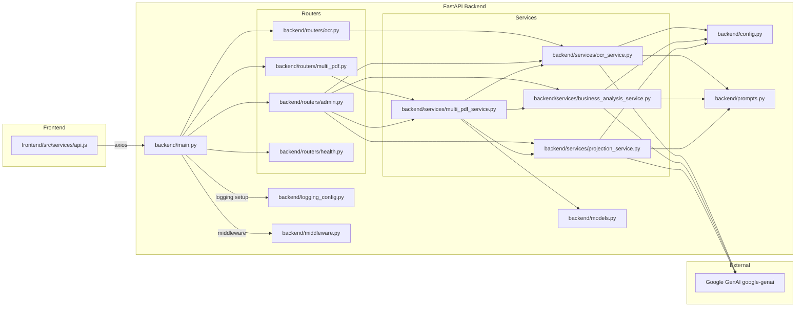
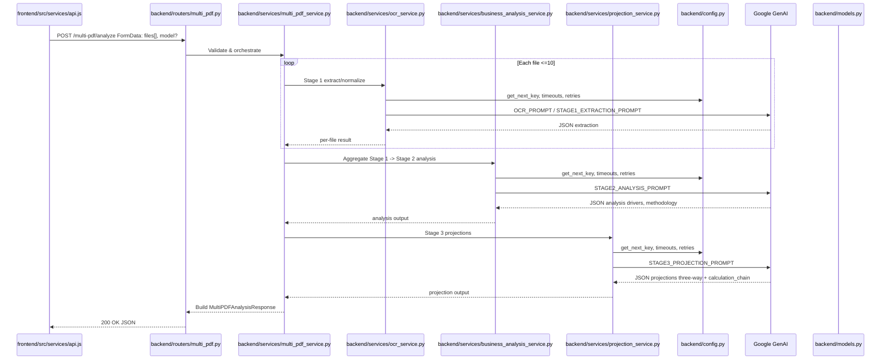
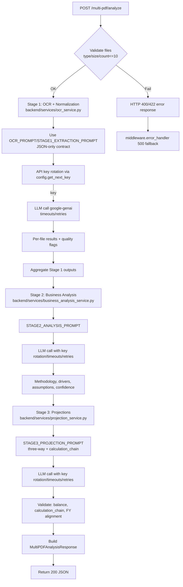
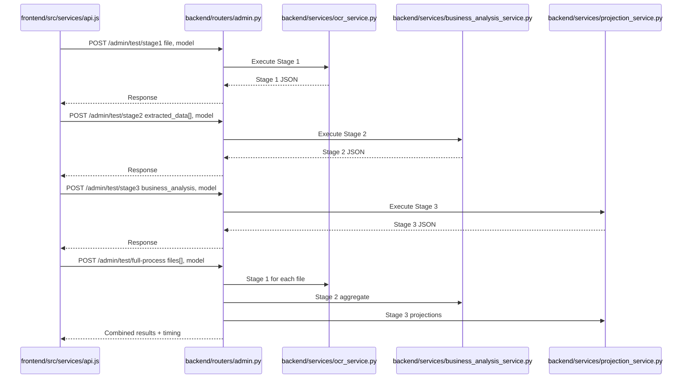
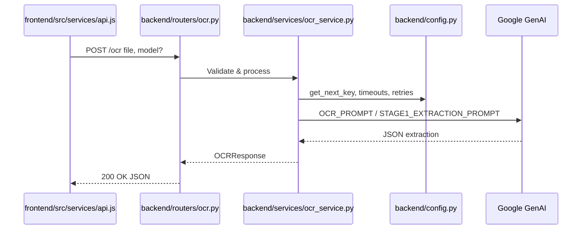
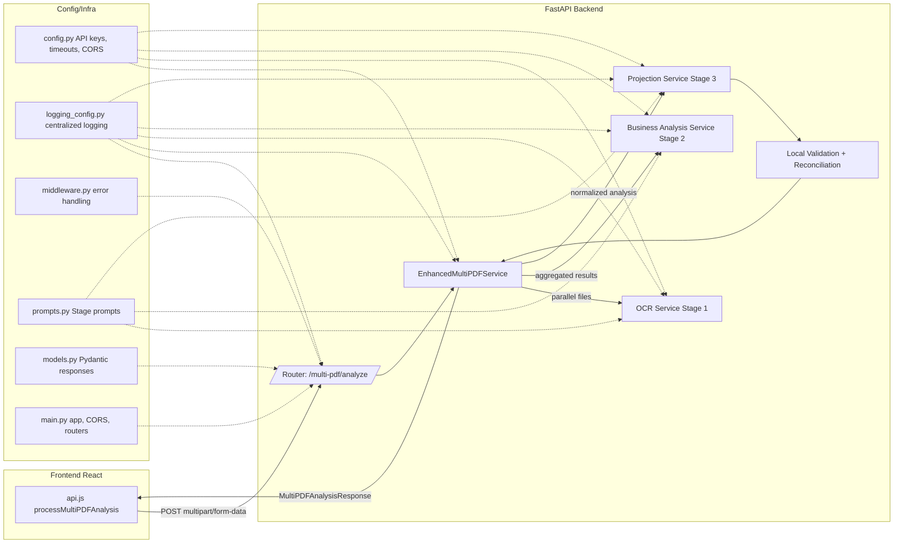
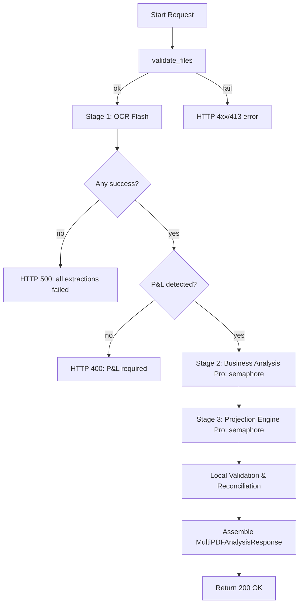
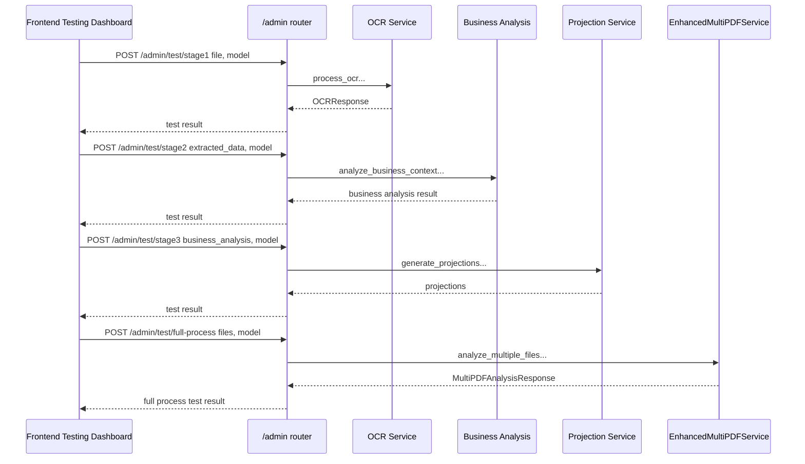

# Backend Multi-Stage Analysis Workflow and Frontend Orchestration

Executive Summary
- Purpose: Provide a deep, implementation-level explanation of the backend multi-stage analysis pipeline Stage 1 extraction/normalization, Stage 2 business analysis, Stage 3 projections and how the frontend orchestrates these flows with precise endpoint mappings, configuration, logging, and error handling.

System Overview and Components
- FastAPI application: [backend/main.py]backend/main.py
- Routers: [backend/routers/ocr.py]backend/routers/ocr.py, [backend/routers/multi_pdf.py]backend/routers/multi_pdf.py, [backend/routers/admin.py]backend/routers/admin.py, [backend/routers/health.py]backend/routers/health.py
- Services: [backend/services/ocr_service.py]backend/services/ocr_service.py, [backend/services/multi_pdf_service.py]backend/services/multi_pdf_service.py, [backend/services/business_analysis_service.py]backend/services/business_analysis_service.py, [backend/services/projection_service.py]backend/services/projection_service.py
- Configuration: [backend/config.py]backend/config.py
- Logging: [backend/logging_config.py]backend/logging_config.py
- Prompts: [backend/prompts.py]backend/prompts.py
- Models: [backend/models.py]backend/models.py
- Middleware: [backend/middleware.py]backend/middleware.py
- Frontend API client: [frontend/src/services/api.js]frontend/src/services/api.js

Component Architecture Mermaid


End-to-End Sequence for /multi-pdf/analyze
- Frontend entrypoint: processMultiPDFAnalysis in [frontend/src/services/api.js]frontend/src/services/api.js
- Backend router: [backend/routers/multi_pdf.py]backend/routers/multi_pdf.py
- Orchestrator service: [backend/services/multi_pdf_service.py]backend/services/multi_pdf_service.py
- Stage 1 service: [backend/services/ocr_service.py]backend/services/ocr_service.py using [prompts.OCR_PROMPT]backend/prompts.py:6 or [prompts.STAGE1_EXTRACTION_PROMPT]backend/prompts.py:41
- Stage 2 service: [backend/services/business_analysis_service.py]backend/services/business_analysis_service.py using [prompts.STAGE2_ANALYSIS_PROMPT]backend/prompts.py:102
- Stage 3 service: [backend/services/projection_service.py]backend/services/projection_service.py using [prompts.STAGE3_PROJECTION_PROMPT]backend/prompts.py:363
- Config for key rotation/timeouts/retries: [backend/config.py]backend/config.py
- Response model: [models.MultiPDFAnalysisResponse]backend/models.py:10

Sequence Diagram


Inputs, Validation, and Timeouts
- Frontend pre-validation in [frontend/src/services/api.js]frontend/src/services/api.js: max 10 files; PDFs up to 50MB, CSVs up to 25MB.
- Axios timeout for multi-PDF: 600000 ms 10 minutes.
- Backend per external call timeout: [config.API_TIMEOUT]backend/config.py:85 = 1800s.
- Overall process timeout default: [config.OVERALL_PROCESS_TIMEOUT]backend/config.py:86 env-driven; default 600s.
- Retries: [config.MAX_RETRIES]backend/config.py:87, [config.RETRY_DELAY]backend/config.py:88.
- API key rotation: [config.get_next_key]backend/config.py:36.

Orchestration Flow Stages 1–3
Flowchart


Constraints enforced throughout:
- JSON-only outputs no code fences, no commentary.
- Calculation chains for every derived metric in Stage 3.
- Australian FY alignment July–June.
- Quarterly dividend payout 40% of net profit reflected in cash flows and retained earnings.

Frontend Services Orchestration
- Axios instance and interceptors in [frontend/src/services/api.js]frontend/src/services/api.js handle long timeouts, JSON cleanup, and error normalization.
- Function → Endpoint mapping:
  - processOCR → POST /ocr
  - processMultiPDFAnalysis → POST /multi-pdf/analyze
  - getHealthStatus → GET /health
  - getAvailableModels → GET /models
  - testStage1 → POST /admin/test/stage1
  - testStage2 → POST /admin/test/stage2
  - testStage3 → POST /admin/test/stage3
  - testFullProcess → POST /admin/test/full-process
  - validateServices → GET /admin/test/validate-services
  - getPerformanceMetrics → GET /admin/performance/metrics
- Client-side validations:
  - Multi-PDF: only PDF/CSV; 50MB PDF, 25MB CSV; max 10 files.
  - OCR single: supports images/PDF/CSV with per-type size limits.

Endpoint → Router → Service → Model Mapping
- POST /ocr → [backend/routers/ocr.py]backend/routers/ocr.py → [backend/services/ocr_service.py]backend/services/ocr_service.py → [models.OCRResponse]backend/models.py:4
- POST /multi-pdf/analyze → [backend/routers/multi_pdf.py]backend/routers/multi_pdf.py → [backend/services/multi_pdf_service.py]backend/services/multi_pdf_service.py → [backend/services/business_analysis_service.py]backend/services/business_analysis_service.py → [backend/services/projection_service.py]backend/services/projection_service.py → [models.MultiPDFAnalysisResponse]backend/models.py:10
- Admin testing:
  - POST /admin/test/stage1 → [backend/routers/admin.py]backend/routers/admin.py → [backend/services/ocr_service.py]backend/services/ocr_service.py
  - POST /admin/test/stage2 → [backend/routers/admin.py]backend/routers/admin.py → [backend/services/business_analysis_service.py]backend/services/business_analysis_service.py
  - POST /admin/test/stage3 → [backend/routers/admin.py]backend/routers/admin.py → [backend/services/projection_service.py]backend/services/projection_service.py
  - POST /admin/test/full-process → [backend/routers/admin.py]backend/routers/admin.py → pipeline through S1→S2→S3
  - GET /admin/test/validate-services → [backend/routers/admin.py]backend/routers/admin.py
  - GET /admin/performance/metrics → [backend/routers/admin.py]backend/routers/admin.py
- Health and models:
  - GET /health → [backend/routers/health.py]backend/routers/health.py
  - GET /models → commonly surfaced via admin router → [backend/routers/admin.py]backend/routers/admin.py

Prompts: Schemas and Constraints
- OCR and Stage 1:
  - [prompts.OCR_PROMPT]backend/prompts.py:6: strict JSON-only extraction; no analysis or code fences.
  - [prompts.STAGE1_EXTRACTION_PROMPT]backend/prompts.py:41: document classification, normalized_time_series, data_quality_assessment.
- Stage 2:
  - [prompts.STAGE2_ANALYSIS_PROMPT]backend/prompts.py:102: business context, methodology evaluation, drivers with specific numeric assumptions, confidence assessments.
- Stage 3:
  - [prompts.STAGE3_PROJECTION_PROMPT]backend/prompts.py:363: three-way forecast; monthly-first then aggregate; calculation_chain requirement for every derived metric; 40% quarterly dividend policy; balance sheet validation.

Configuration, Timeouts, Retries, CORS, Logging
- API Keys and rotation:
  - Load keys: [config.get_api_keys]backend/config.py:10
  - Rotation: [config.get_next_key]backend/config.py:36
  - Current key: [config.get_current_key]backend/config.py:43
- Timeouts and retries:
  - Per-call API timeout: [config.API_TIMEOUT]backend/config.py:85
  - Overall process timeout: [config.OVERALL_PROCESS_TIMEOUT]backend/config.py:86
  - Retries: [config.MAX_RETRIES]backend/config.py:87, [config.RETRY_DELAY]backend/config.py:88
- CORS:
  - Allowed origins for local dev: [config.ALLOWED_ORIGINS]backend/config.py:96
- Logging:
  - Setup: [logging_config.setup_logging]backend/logging_config.py:31
  - Logger access: [logging_config.get_logger]backend/logging_config.py:62
  - Helpers: [logging_config.log_api_call]backend/logging_config.py:95, [logging_config.log_stage_progress]backend/logging_config.py:126, [logging_config.log_validation_result]backend/logging_config.py:134
- Middleware error handling:
  - [middleware.error_handler]backend/middleware.py:11 returns JSON 500 on unexpected exceptions.

Error Handling and Validation
- FastAPI validation errors: 422 with detail list for schema issues.
- Unexpected exceptions: middleware returns {"detail":"Internal server error","error_code":"INTERNAL_ERROR"}.
- Frontend axios interceptor in [frontend/src/services/api.js]frontend/src/services/api.js normalizes error messages, preferring response.data.detail or response.data.error where present.

Performance and Timeout Strategy
- Frontend:
  - Default axios timeout: 10 minutes; multi-PDF explicitly 10 minutes; Stage 2 test: 5 minutes.
- Backend:
  - Uvicorn server setup in [backend/main.py]backend/main.py uses long keep-alive and graceful shutdown tuned for long-running requests.
  - LLM call timeout and retry governed by config constants.
- Throughput considerations:
  - Stage 1 per-file fanout can be sequential or batched within constraints of rate limits and overall timeout; rotate keys to mitigate throttling.

Security and CORS
- Restrict origins via [config.ALLOWED_ORIGINS]backend/config.py:96.
- API keys from environment; .env files excluded by [backend/.gitignore]backend/.gitignore.
- Avoid logging full secrets; log only suffixes when necessary.

Admin Testing Swimlane


Example Requests and Responses
- POST /multi-pdf/analyze multipart
  - Request form-data fields:
    - files: multiple PDF/CSV files max 10
    - model: optional model name e.g., "gemini-2.5-flash"
  - Example response structure aligned with [models.MultiPDFAnalysisResponse]backend/models.py:10:
```
{
  "success": true,
  "extracted_data": [{ "filename": "report1.pdf", "document_type": "Profit and Loss", "normalized_time_series": { /* ... */ } }],
  "normalized_data": { "period_granularity": "monthly", "combined_series": { /* ... */ } },
  "projections": { "base_case_projections": { /* three-way statements with calculation_chain */ } },
  "explanation": "Summary of methodology and key assumptions",
  "period_granularity": "monthly",
  "total_data_points": 240,
  "time_span": "2019-07 to 2024-06",
  "seasonality_detected": true,
  "data_quality_score": 0.86,
  "confidence_levels": { "1_year": "high", "3_years": "medium", "5_years": "low" }
}
```

- POST /admin/test/stage2 application/json
  - Request body:
```
{
  "extracted_data": [
    { "filename": "report1.pdf", "success": true, "data": { "normalized_time_series": { /* ... */ } } }
  ],
  "model": "gemini-2.5-flash"
}
```
  - Response shape matches Stage 2 schema defined by [prompts.STAGE2_ANALYSIS_PROMPT]backend/prompts.py:102.

Constraints and Assumptions
- LLM outputs must be JSON-only no code fences, no extraneous text.
- Multi-file limits: max 10; PDFs up to 50MB; CSVs up to 25MB; images up to 10MB for /ocr.
- Stage 3 calculation_chain is required for each derived metric.
- Dividend policy: 40% of net profit paid quarterly; modeled in cash flow from financing and retained earnings adjustments.
- Australian FY alignment: July–June; aggregate quarterly/yearly strictly from monthly calculations no re-calculation at higher levels.

Cross-References
- [gitbook documentations/01-system-overview.md]gitbook documentations/01-system-overview.md
- [gitbook documentations/02-stage1-data-extraction.md]gitbook documentations/02-stage1-data-extraction.md
- [gitbook documentations/03-stage2-business-analysis.md]gitbook documentations/03-stage2-business-analysis.md
- [gitbook documentations/04-stage3-projection-engine.md]gitbook documentations/04-stage3-projection-engine.md
- [gitbook documentations/05-validation-quality-assurance.md]gitbook documentations/05-validation-quality-assurance.md
- [gitbook documentations/06-api-reference-usage.md]gitbook documentations/06-api-reference-usage.md
- [gitbook documentations/07-configuration-setup.md]gitbook documentations/07-configuration-setup.md

Appendix: Single-file OCR /ocr Sequence

# Backend Multi-Stage Workflow and Orchestration

Purpose
This document provides an in-depth, publication-ready overview of the backend multi-stage workflow powering the OCR and financial analysis engine. It covers the end-to-end flow for multi-document analysis, including orchestration logic, service responsibilities, configuration, logging, error handling, performance considerations, constraints, and frontend integration points. It is designed as the authoritative reference for developers and operators.

Executive Summary
The system implements a 3-stage, modular analysis pipeline:
1 Stage 1 — Extraction and Normalization: High-throughput OCR and data shaping for PDFs/CSVs using a fast model tier, with data quality assessment and Australian FY alignment. Prompt spec defined in [prompts.py OR STAGE1_EXTRACTION_PROMPT]backend/prompts.py:41.
2 Stage 2 — Business Analysis and Methodology Selection: Deep analysis across aggregated documents; selects forecasting methodology, defines drivers, and establishes assumptions. Prompt spec defined in [prompts.py OR STAGE2_ANALYSIS_PROMPT]backend/prompts.py:102.
3 Stage 3 — Projection Engine: Three-way forecast P&L, Cash Flow, Balance Sheet, dividend policy implementation 40% payout, quarterly, and scenario projections. Prompt spec defined in [prompts.py OR STAGE3_PROJECTION_PROMPT]backend/prompts.py:363.

The orchestrator [multi_pdf_service.py OR EnhancedMultiPDFService.analyze_multiple_files]backend/services/multi_pdf_service.py:365 coordinates these stages with tiered model selection Flash for extraction; Pro for analysis, concurrency control via semaphore, global timeouts, and local validation through [projection_service.py OR ProjectionService.validate_projections]backend/services/projection_service.py:775. The HTTP entrypoint is [/multi-pdf/analyze in routers/multi_pdf.py OR analyze_multiple_files]backend/routers/multi_pdf.py:15, returning a typed response [models.py OR MultiPDFAnalysisResponse]backend/models.py:10 to the frontend, which calls via [api.js OR processMultiPDFAnalysis]frontend/src/services/api.js:208.

High-Level Architecture Component/Flow Diagram


End-to-End Sequence for /multi-pdf/analyze
```mermaid
sequenceDiagram
  autonumber
  participant FE as Frontend api.js
  participant RT as FastAPI Router /multi-pdf/analyze
  participant ORC as EnhancedMultiPDFService
  participant S1 as OCR Service Stage 1
  participant S2 as Business Analysis Stage 2
  participant S3 as Projection Service Stage 3
  participant VAL as Local Validation
  participant LOG as logging_config.py

  FE->>RT: POST /multi-pdf/analyze files[], model
  RT->>LOG: log_request_start...
  RT->>RT: Read all file contents
  RT->>ORC: analyze_multiple_filesfiles_data, model
  ORC->>LOG: log_request_startstage summary
  ORC->>ORC: validate_files
  par Stage 1 parallel per file
    ORC->>S1: process_ocrcontent, filename, "gemini-2.5-flash"
    S1-->>ORC: OCRResponse JSON text/data
  end
  ORC->>ORC: aggregate successes/errors; ensure P&L present
  ORC->>S2: analyze_business_contextsuccessful_extractions, "gemini-2.5-pro" semaphore-limited
  S2-->>ORC: business_context + methodology + drivers
  ORC->>S3: generate_projectionsstage2_result, "gemini-2.5-pro" semaphore-limited
  S3-->>ORC: base_case_projections + scenarios + methodology
  ORC->>VAL: validate_projectionsstage3_result
  VAL-->>ORC: validation_results overall_score, warnings, errors
  ORC-->>RT: MultiPDFAnalysisResponse success, extracted_data, normalized_data, projections,...
  RT->>LOG: log_request_end...
  RT-->>FE: 200 OK JSON
```

Stage Orchestration Flow Decision/Control


Optional: Admin Testing Endpoints Swimlane


Key Files, Endpoints, and Services

Server and Middleware
- App server: [backend/main.py]backend/main.py
  - FastAPI app initialization at [main.py OR app = FastAPI...]backend/main.py:25
  - CORS applied from [config.py OR ALLOWED_ORIGINS]backend/config.py:95 at [main.py OR app.add_middlewareCORSMiddleware,...]backend/main.py:28
  - Router inclusion at [main.py OR app.include_router...]backend/main.py:40
  - Error middleware applied at [main.py OR app.middleware"http"error_handler]backend/main.py:37
  - Uvicorn run with keep-alive/graceful timeouts at [main.py OR uvicorn.run...]backend/main.py:52

- Centralized logging: [backend/logging_config.py]backend/logging_config.py
  - Setup at [logging_config.py OR setup_logging]backend/logging_config.py:31
  - Logger getter at [logging_config.py OR get_logger]backend/logging_config.py:62
  - Request lifecycle utilities: [log_request_start]backend/logging_config.py:76, [log_request_end]backend/logging_config.py:85, [log_api_call]backend/logging_config.py:95, [log_file_processing]backend/logging_config.py:107, [log_stage_progress]backend/logging_config.py:126, [log_validation_result]backend/logging_config.py:134

- Error handling middleware: [backend/middleware.py OR error_handler]backend/middleware.py:11
  - Returns [models.py OR ErrorResponse]backend/models.py:34-compatible JSON structure on unexpected exceptions.

Configuration
- Primary configuration: [backend/config.py]backend/config.py
  - API key rotation: [config.py OR get_next_key]backend/config.py:36 and pool [config.py OR API_KEYS]backend/config.py:33
  - Timeouts and retries: [config.py OR API_TIMEOUT]backend/config.py:85, [config.py OR OVERALL_PROCESS_TIMEOUT]backend/config.py:86, [config.py OR MAX_RETRIES]backend/config.py:87, [config.py OR RETRY_DELAY]backend/config.py:88
  - CORS origins: [config.py OR ALLOWED_ORIGINS]backend/config.py:95

Models and Prompts
- Response models: [backend/models.py]backend/models.py
  - OCR response: [models.py OR OCRResponse]backend/models.py:4
  - Multi-PDF response: [models.py OR MultiPDFAnalysisResponse]backend/models.py:10
  - Error response: [models.py OR ErrorResponse]backend/models.py:34

- Prompts: [backend/prompts.py]backend/prompts.py
  - Stage 1: [prompts.py OR STAGE1_EXTRACTION_PROMPT]backend/prompts.py:41
  - Stage 2: [prompts.py OR STAGE2_ANALYSIS_PROMPT]backend/prompts.py:102
  - Stage 3: [prompts.py OR STAGE3_PROJECTION_PROMPT]backend/prompts.py:363

Routers
- Health/info: [backend/routers/health.py]backend/routers/health.py
  - [health.py OR health_check]backend/routers/health.py:8
  - [health.py OR get_available_models]backend/routers/health.py:13

- OCR: [backend/routers/ocr.py]backend/routers/ocr.py
  - [ocr.py OR process_ocr]backend/routers/ocr.py:13 → [ocr_service.process_ocr]backend/services/ocr_service.py:1 [referenced service file exists; see service overview below]

- Multi-PDF: [backend/routers/multi_pdf.py]backend/routers/multi_pdf.py
  - [multi_pdf.py OR analyze_multiple_files]backend/routers/multi_pdf.py:15 → [multi_pdf_service.analyze_multiple_files]backend/services/multi_pdf_service.py:365

- Admin/testing: [backend/routers/admin.py]backend/routers/admin.py
  - [admin.py OR get_detailed_health]backend/routers/admin.py:23
  - [admin.py OR test_stage1_ocr]backend/routers/admin.py:103
  - [admin.py OR test_stage2_business_analysis]backend/routers/admin.py:145
  - [admin.py OR test_stage3_projections]backend/routers/admin.py:221
  - [admin.py OR test_full_process]backend/routers/admin.py:253
  - [admin.py OR validate_all_services]backend/routers/admin.py:310
  - [admin.py OR get_performance_metrics]backend/routers/admin.py:380

Services Stage Implementations and Orchestrator
- Orchestrator service: [backend/services/multi_pdf_service.py]backend/services/multi_pdf_service.py

## Services Stage Implementations and Orchestrator — Detailed Completion

This section completes and deepens the stage responsibilities and orchestration design based on the current codebase.

### Orchestrator: EnhancedMultiPDFService

Primary entrypoint: [multi_pdf_service.py OR EnhancedMultiPDFService.analyze_multiple_files]backend/services/multi_pdf_service.py:365

Core responsibilities:
- Input validation: [EnhancedMultiPDFService.validate_files]backend/services/multi_pdf_service.py:100 enforces non-empty list, max 10 files, size limits 50MB PDF, 25MB CSV, type checks via [get_file_type_and_mime]backend/services/multi_pdf_service.py:79. Returns HTTP 400/413 on violations.
- Stage 1 fan-out: Builds asyncio tasks to call [ocr_service.process_ocr]backend/services/ocr_service.py:262 for each file concurrently with Flash model, gathers with return_exceptions to capture per-file errors.
- Aggregation: Parses successful OCR results to normalized records, tracks document types, and builds per-file outcome arrays success/failure. Ensures at least one P&L is present before proceeding.
- Stage 2 call: Invokes [business_analysis_service.analyze_business_context]backend/services/business_analysis_service.py:385 with successful extractions only. Wraps the call in a Pro-model semaphore to cap concurrent Pro calls.
- Stage 3 call: Invokes [projection_service.generate_projections]backend/services/projection_service.py:681 using the Stage 2 output, also under the Pro-model semaphore.
- Local validation: Calls [projection_service.validate_projections]backend/services/projection_service.py:775 to perform reconciliation, consistency checks, and optional semantic AI validation.
- Final response assembly: Builds [models.MultiPDFAnalysisResponse]backend/models.py:10 including enhanced metadata, timings, service info, model strategy, confidence levels via [projection_service.get_confidence_levels]backend/services/projection_service.py:771, and methodology string via [projection_service.get_methodology_string]backend/services/projection_service.py:767.
- Timeout management: The outer process is wrapped by asyncio.wait_for with [config.OVERALL_PROCESS_TIMEOUT]backend/config.py:86. On TimeoutError, returns a MultiPDFAnalysisResponse with success=false and message.
- Retries: Retries are delegated to Stage services. Orchestrator aggregates results and handles stage-level failures.
- Error handling: Uses HTTPException for client errors e.g., invalid files, missing P&L and catches unexpected exceptions to emit a structured MultiPDFAnalysisResponse with success=false.

Model selection and concurrency:
- Stage 1 uses Flash model by default: [self.stage1_model = "gemini-2.5-flash"]backend/services/multi_pdf_service.py:51.
- Stages 2–3 force Pro model via [get_analysis_model]backend/services/multi_pdf_service.py:68, ensuring complex analysis uses Pro even if client requests Flash.
- Semaphore for Pro calls: [self.pro_model_semaphore = asyncio.Semaphore3]backend/services/multi_pdf_service.py:55 limiting concurrent Pro calls in Stage 2 and Stage 3 to 3 to protect quotas and reduce throttling risk. Notes:
  - If workloads are heavy or keys many, consider raising to 4–6; if hitting rate limits, reduce to 1–2.
  - Stage 1 fan-out can remain unconstrained as it uses Flash.

Batching opportunities:
- Stage 1: For large numbers of files near 10 max, batch into groups e.g., 3–4 with asyncio.gather per batch to bound memory and observe API quotas. Current implementation fans out all at once but can be trivially adapted.
- Stage 2 and 3 are single calls and already protected by semaphore.

Checklist — Orchestrator
- Inputs:
  - files_data: List[Tuple[filename, bytes]]
  - requested_model: str client hint
- Outputs:
  - [models.MultiPDFAnalysisResponse]backend/models.py:10 with extracted_data, normalized_data, projections, metadata, and optional error.
- Failure modes:
  - Invalid file types/sizes → HTTP 400/413.
  - All Stage 1 results failed → HTTP 500.
  - Missing P&L → HTTP 400.
  - Overall timeout exceeded → success=false response with timeout message.
  - Unexpected errors → success=false response; middleware may catch raised exceptions at router.

### Stage 1: EnhancedOCRService

Entrypoint: [ocr_service.py OR EnhancedOCRService.process_ocr]backend/services/ocr_service.py:262

Responsibilities:
- Handle PDFs, CSVs, and images with size/type checks in [validate_file]backend/services/ocr_service.py:108 and type detection via [get_file_type_and_mime]backend/services/ocr_service.py:61.
- Prompt selection: Uses [prompts.STAGE1_EXTRACTION_PROMPT]backend/prompts.py:41 for structured extraction and normalization. OCR-only prompt [prompts.OCR_PROMPT]backend/prompts.py:6 may be used by design, but current code paths use STAGE1_EXTRACTION_PROMPT directly.
- JSON-only enforcement: The prompt requires pure JSON output. The service parses code-fenced or raw JSON from the model response; on failure, it returns OCRResponsesuccess=false, error="JSON parsing failed..." rather than throwing, allowing orchestrator to continue others.
- Australian FY normalization: The prompt and downstream interpretation normalize to July–June. The Stage 1 output should include basic_context/reporting_frequency and normalized_time_series keyed by YYYY-MM or similar.
- Anomaly detection and data quality: The prompt includes data_quality_assessment with completeness_score and flags; the service logs key indicators
