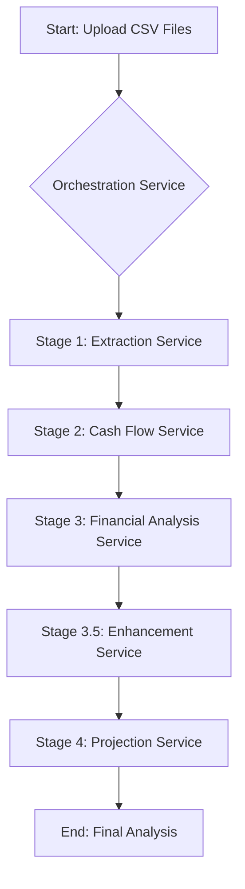

# Orchestration Service

The Orchestration Service is the central nervous system of the backend, responsible for coordinating the entire multi-document analysis process. When you upload CSV files for a profit and loss statement and a balance sheet, this service manages the flow of data between various specialized services, ensuring a seamless and comprehensive analysis.

## Step-by-Step Workflow

The following diagram illustrates the step-by-step process managed by the Orchestration Service:

### 1. File Validation

Before initiating the analysis, the Orchestration Service validates the uploaded files to ensure they meet the following criteria:

-   **File Type**: Only `PDF` and `CSV` files are accepted.
-   **File Size**: `PDF` files must not exceed 50MB, and `CSV` files are limited to 25MB.
-   **File Count**: A maximum of 10 files can be processed in a single request.

### 2. Stage 1: Data Extraction

The Orchestration Service invokes the **Extraction Service** to process each uploaded file. This service:

-   Identifies the document type (e.g., "Profit and Loss," "Balance Sheet").
-   Extracts the relevant financial data from the files.
-   Standardizes the data into a structured format.

### 3. Stage 2: Cash Flow Analysis

Once the data has been extracted, the Orchestration Service passes the structured data to the **Cash Flow Service**. This service:

-   Generates a cash flow statement from the profit and loss and balance sheet data.
-   Analyzes the cash flow to determine the company's business stage (e.g., "Growth," "Mature").

### 4. Stage 3: Financial Analysis

The **Financial Analysis Service** receives the cash flow analysis and performs a comprehensive review of the company's financial health. This includes:

-   Calculating key financial ratios.
-   Identifying trends and anomalies.
-   Assessing the overall financial performance.

### 5. Stage 3.5: Strategic Enhancement

The **Enhancement Service** takes the financial analysis and enriches it with strategic insights. This may include:

-   Identifying potential risks and opportunities.
-   Providing recommendations for improvement.
-   Offering a qualitative assessment of the company's financial strategy.

### 6. Stage 4: Financial Projections

Finally, the **Projection Service** uses the enhanced analysis to generate financial projections. This service:

-   Forecasts future financial performance based on historical data and strategic insights.
-   Creates multiple projection scenarios (e.g., "Base Case," "Optimistic," "Pessimistic").
-   Documents the assumptions and methodologies used to generate the projections.

### 7. Final Response

The Orchestration Service assembles the results from all stages into a single, comprehensive response. This response includes the extracted data, financial analysis, strategic insights, and detailed projections, providing a complete picture of the company's financial health and future outlook.