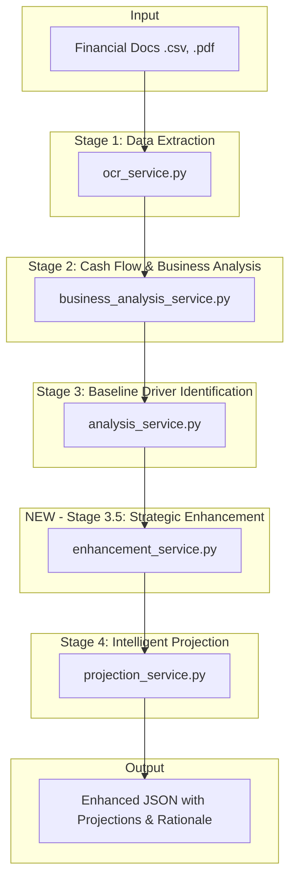

# Plan for an Intelligent, Self-Correcting Projection Engine

This document outlines a revised, comprehensive plan to transform the projection engine into an intelligent system that not only addresses the initial feedback but also incorporates advanced reasoning, external factor analysis, and transparent reporting.

## 1. Refactor Backend File Structure for Clarity and Maintainability

Before implementing new features, we will refactor the backend file structure to align with industry best practices. This will improve clarity, reduce ambiguity, and make the system more maintainable.

*   **Analysis:** Scan all files in the `backend` directory to understand their purpose.
*   **Renaming Strategy:** Propose new, intuitive names that accurately reflect each file's functionality (e.g., `ocr.py` becomes `data_extraction_router.py`).
*   **Reference Updates:** Update all import statements and references throughout the codebase to reflect the new file names.

## 2. Proposed Architecture Enhancement

The current linear pipeline will be enhanced by introducing a new stage, **Stage 3.5: Strategic Enhancement & External Factor Analysis**, to create a more sophisticated data flow.

### New System Architecture Diagram

## 3. API and Service Layer Modifications for Date Handling

To address the incorrect start date, we will introduce a dedicated parameter.

*   **API Endpoint:** The `analyze_multiple_files` function in `backend/routers/multi_pdf.py` will be modified to accept an optional `projection_start_date: str = Form(default="YYYY-MM-DD")`.
*   **Data Flow:** This `projection_start_date` will be passed down through `multi_pdf_service` to the final `projection_service`.
*   **Prompt Integration:** The `STAGE4_PROJECTION_PROMPT` will be updated to include a placeholder for this date, making it a direct and unambiguous instruction for the AI. The Australian financial year context will remain in the analysis prompts to ensure correct interpretation of historical data.

## 4. Design the New "Strategic Enhancement" Service (Stage 3.5)

This new service will be the core of the system's enhanced intelligence.

*   **New File:** Create `backend/services/enhancement_service.py`.
*   **New Prompt:** Create `STAGE3_5_ENHANCEMENT_PROMPT` in `backend/prompts.py`.
*   **Functionality:** This service will instruct the AI to:
    1.  Receive the baseline analysis and key drivers from Stage 3.
    2.  **Act as an expert financial strategist.**
    3.  **Simulate external research:** Consider macroeconomic factors (inflation, interest rates), industry-specific trends for plumbing and construction in Australia, and potential impacts of global events.
    4.  Generate a structured set of **"enhancement factors"** with detailed **rationale** for each adjustment (e.g., "Increase Q1 COGS by 3% due to projected supply chain disruptions in the APAC region").
    5.  Output this analysis as a clean JSON object to be consumed by Stage 4.

## 5. Redesign the Projection Engine (Stage 4) for Intelligent Forecasting

The final stage will be redesigned to synthesize all prior information into a comprehensive forecast.

*   **Service Modification:** The `projection_service.py` will be updated to call the new `enhancement_service` and integrate its output.
*   **Prompt Overhaul (`STAGE4_PROJECTION_PROMPT`):** The prompt will be completely rewritten to instruct the AI to:
    1.  Use the `projection_start_date` to begin all forecasts.
    2.  Generate a **"Base Case"** projection using only the historical drivers from Stage 3.
    3.  Generate an **"Enhanced Case"** projection by applying the strategic enhancement factors from Stage 3.5 to the Base Case.
    4.  Incorporate Tas's specific feedback regarding **monthly granularity** and **holiday impacts** (e.g., "Model a 15% reduction in January revenue due to the holiday period, followed by a rebound in February").
    5.  Produce a **"Commentary and Rationale"** section in the final JSON output. This section will explain the differences between the Base and Enhanced cases, referencing the rationale provided by Stage 3.5, and detailing the specific seasonality adjustments made.

## 6. Develop a Comprehensive Validation & Testing Strategy

The testing plan will be expanded to cover the new architecture:

*   **Unit Tests:** For the new `enhancement_service` and its logic.
*   **Integration Tests:** To ensure the data flows correctly from Stage 3 through 3.5 to Stage 4.
*   **End-to-End Tests:** Using the provided CSV files to:
    *   Verify the `projection_start_date` is correctly applied.
    *   Confirm that the "Enhanced Case" projections are different from the "Base Case" and reflect the rationale from Stage 3.5.
    *   Check that the final JSON output contains the detailed "Commentary and Rationale" section.

## 7. Present the Revised Plan for Approval

This comprehensive plan, once finalized, will be presented for approval before implementation begins.