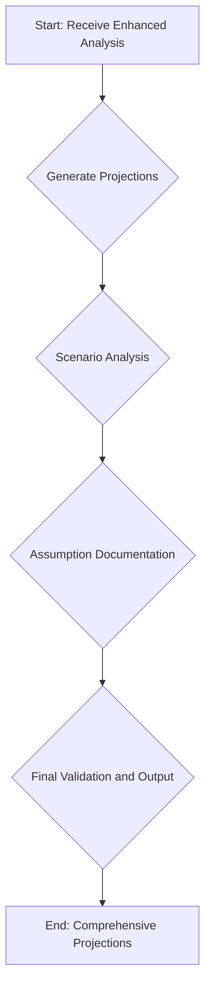

# Projection Service

The Projection Service is the final stage in the analysis pipeline, responsible for generating detailed financial projections. This service synthesizes all the information from the previous stages to produce a comprehensive and data-driven forecast of the company's future financial performance.

## Key Responsibilities

The following diagram illustrates the key responsibilities of the Projection Service:

### 1. Projection Generation

The service takes the enhanced analysis from the previous stage and sends it to the **Google Gemini Pro** model. The model is prompted to generate detailed financial projections for multiple time horizons, including:

-   **1-Year Ahead**: Monthly projections.
-   **3-Years Ahead**: Quarterly projections.
-   **5, 10, and 15-Years Ahead**: Yearly projections.

For each time horizon, the service generates projections for key financial metrics, including `revenue`, `expenses`, `gross_profit`, and `net_profit`.

### 2. Scenario Analysis

In addition to the base-case projections, the service also generates two alternative scenarios:

-   **Optimistic Scenario**: A best-case forecast that assumes favorable market conditions and successful strategic execution.
-   **Conservative Scenario**: A worst-case forecast that accounts for potential market downturns and operational challenges.

This provides a more complete picture of the potential range of future outcomes.

### 3. Assumption Documentation

A critical function of this service is to document the key assumptions used to generate the projections. This includes:

-   **Revenue Growth**: The assumed annual growth rate for revenue.
-   **Gross Margin**: The projected gross margin as a percentage of revenue.
-   **Net Profit Margin**: The expected net profit margin.

Documenting these assumptions provides transparency and allows for more informed decision-making.

### 4. Final Validation and Output

Before finalizing the output, the service performs a validation check to ensure that all required projection data is present and correctly formatted. If the validation is successful, the service assembles the complete set of projections, including the base case, alternative scenarios, and assumption documentation, into a single, comprehensive response.

If the validation fails, the service generates a complete fallback projection to ensure that a valid and usable forecast is always provided.